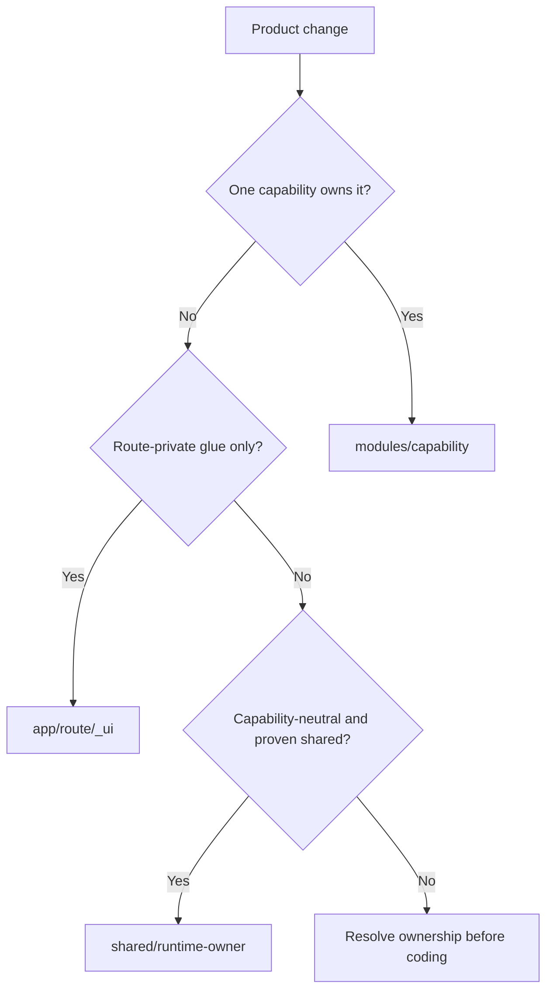

# ADR 0001: Capability-First Modules

- Status: Proposed
- Date: 2026-07-27
- Decision owner: nextjs-clean-skills maintainers
- Baseline: `tests/architecture-pilots/baseline.json`
- Candidate plan: `tests/architecture-pilots/candidate-plan.json`
- Layer-first control: `626140b5d68e5b3afcfc80e209df5d881f35d59c`

This ADR is a hypothesis to test, not the current skill contract. It becomes Accepted only after
the three architecture pilots and comparative agent evaluations pass the gates below.

## Context

The layer-first 2.0 checkpoint corrected real defects but made thirteen global path categories the
primary architecture. Those categories mix domain, application policy, contracts, driving and
driven adapters, framework surfaces, browser cache, and technical helpers. Capability ownership is
documented but not physically protected.

The reference template shows the cost. `work-items` is spread across thirteen architecture files
before route-private UI is counted. Its six exported use-case functions all have at most two
statements; four directly forward to `deps.workItems`. Server Actions and Route Handlers repeat
composition and cache work, while client reads call Server Actions.

The redesign must improve capability locality without losing core purity, runtime separation, or
enforceable dependency direction.

## Decision

### 1. The module is the primary unit

Product behavior lives under one capability root:

```text
src/modules/<capability>/
```

Framework routes remain under `src/app/**`. Route-private presentation stays beside its route.
Promote it to a module only when it represents product behavior, has another route consumer, or
needs a stable runtime contract.



### 2. Segments are reserved but optional

A capability may use these internal segments:

| Segment | Responsibility | May be omitted when |
| --- | --- | --- |
| `domain/` | pure domain types, invariants, calculations | the capability has no independent domain rule |
| `application/` | policy, orchestration, projections, owned ports | no behavior passes the deletion test |
| `server/` | server queries, persistence, providers, cache wiring | the capability is client-only |
| `client/` | browser async lifecycle, realtime, optimistic state | RSC owns every read and interaction |
| `ui/` | reusable capability UI | all presentation is route-private |

Creating an empty segment is invalid. When a segment exists, its dependency direction is enforced.
Code cannot hide application policy inside `server/` merely to avoid application rules.

The smallest valid capability may be one server file plus one public server surface. Complexity is
progressive, not scaffolded.

### 3. Public surfaces are runtime-specific root files

Cross-module consumers cannot import another module's internal directories. A module publishes only
the root files it needs:

```text
src/modules/work-items/
├── domain/
├── application/
├── server/
├── client/
├── ui/
├── server.ts        # trusted server API
├── rsc.ts           # current-request RSC API
├── actions.ts       # top-level 'use server', async mutations only
├── client.ts        # browser-safe API
└── ui.ts            # reusable capability UI
```

This is a maximum vocabulary, not a required tree. A universal `api/` directory is rejected because
it mixes runtime boundaries and encourages barrels.

A public surface is valid only when it:

1. narrows the internal surface, strengthens the contract, or establishes a runtime boundary;
2. exposes fewer concepts than it hides;
3. contains no one-to-one rename or re-export whose removal changes no consumer dependency.

Public surface drift must be checked against actual exports. The pilot decides whether direct files
or package subpath exports provide the clearest enforceable contract.

### 4. Dependency direction is small and module-aware

Conceptually:

```text
domain <- application <- adapters <- framework composition
```

Operational rules:

1. `app/**` composes module public surfaces.
2. A module cannot import another module's internal path.
3. `domain/**` imports only its own domain and admitted `shared/kernel`.
4. `application/**` imports its domain, pure helpers, and capability-owned ports.
5. `application/**` imports no React, Next.js, database SDK, provider SDK, or concrete adapter.
6. `server/**` may implement driving or driven adapters for its own capability.
7. `client/**` may import its own browser-safe contract and exact `actions.ts` surface.
8. `ui/**` may import its own domain/client surfaces and `shared/ui`.
9. `actions.ts` is the only general client-to-server exception; browser code cannot import
   `server.ts`, `rsc.ts`, or `server/**`.
10. Cross-capability workflows belong to an orchestrating capability or an outer composition root.
11. Module dependencies are acyclic.

Reserved segment names preserve path-based enforcement when the segment exists. Capability-first
therefore trades mandatory folders for optional, still recognizable roles.

### 5. Application behavior keeps the deletion test

An application operation exists only when deleting it moves meaningful policy, branching,
projection, transaction intent, or coordination into callers.

A thin public surface may exist for module or runtime encapsulation, but it must pass the narrowing
gate above. Renaming a data function does not create an operation or a facade.

Simple CRUD may be:

```text
channel boundary -> capability server service -> data adapter
```

Real application behavior is:

```text
channel boundary -> application operation -> explicit dependency
```

The operation is framework-neutral and reports nothing.

### 6. Ports are capability-owned

A port lives under the application code that needs the capability:

```text
modules/<owner>/application/ports/<capability>.ts
```

Create it only when:

1. application behavior needs to name the capability independently of technology;
2. the contract is expressed in application language rather than CRUD or SDK terms;
3. inversion protects real volatility, ownership, isolation, or substitution;
4. a production consumer exists now.

Adapter count, locality, and mocks are evidence, not gates. Direct persistence remains a driven
adapter even when no port is introduced.

### 7. Boundary policy is shared; channel behavior is not

All channels use the same semantic distinction:

```text
expected application outcome -> typed value
unexpected defect or outage  -> exception
framework control flow        -> framework boundary
```

Shared primitives may define safe failure codes, reporter context, redaction, and provider-error
mapping. Outer channel adapters remain distinct:

| Channel | Expected outcome | Unexpected failure | Framework control flow |
| --- | --- | --- | --- |
| RSC query | renderable value/state | report once, then throw | `redirect`/`notFound` stays outside generic catches |
| Server Action | typed action/form state | report once, then throw | redirect only at the action boundary |
| HTTP | status, headers, public body | report once, generic 5xx | response lifecycle owns mapping |
| stream | pre-commit status or in-band event | report once; abort/event after commit | commit state is explicit |
| job | typed retry/drop decision | report once, retry/dead-letter | runner owns cancellation and deadline |

There is no universal result wrapper. A common helper is acceptable only when channels retain their
native contracts and framework behavior.

### 8. Context and dependencies stay explicit

`RequestContext` contains request identity only:

- actor identity and roles;
- tenant or ownership scope;
- request and trace identifiers.

Database clients, provider clients, reporter, clock, and other effects are explicit dependencies.
Operations receive the smallest dependency object they use. No framework object or database client
enters a portable application context.

Authentication belongs to the channel/server boundary. Business authorization belongs to
domain/application policy. Store ownership and tenant predicates remain enforced at the
database/RLS boundary.

### 9. Validation follows trust boundaries

- Validate untrusted input at the channel boundary.
- Validate provider or database data when it enters trusted code.
- Validate serialized output at an external/public contract.
- Do not re-parse a typed internal return value because it crossed a directory.

The pilot measures output-validation cost before any per-call output rule becomes mandatory.

Domain model, public contract, and provider row are separate when their semantics or naming differ.
An adapter maps provider rows into domain/public values. Reusing one schema is acceptable only when
the shapes are intentionally identical, not merely convenient.

### 10. Shared code has admission and reversal rules

Allowed shared roots are runtime-specific:

```text
shared/kernel
shared/server
shared/client
shared/ui
```

Admission to `shared/server`, `shared/client`, or `shared/ui` requires:

1. at least two real capability consumers;
2. identical meaning and lifecycle for those consumers;
3. a named owner and narrow public contract;
4. copying is now more expensive than publishing and coordinating the contract;
5. no capability is the natural semantic owner.

`shared/kernel` has a stricter gate. A pure type or rule moves there only when its invariants,
terminology, and change cadence are identical across at least two capabilities and neither
capability can redefine it independently. Similar names such as `Email` or `UserId` are not enough.

Demote shared code when one capability becomes its owner, consumers diverge, or most changes follow
one capability. `shared/**/utils`, broad service bags, and generic migration buckets are invalid.

### 11. Runtime poisoning needs two controls

Module ownership rules and runtime safety are separate:

- path rules prevent internal and wrong-direction imports;
- `server-only` and `client-only` mark runtime code;
- a production build proves that client bundles do not include server modules;
- each public runtime surface gets a failing mutation that imports the wrong runtime.

Capability colocation is not allowed to weaken server/client isolation.

### 12. The enforcement floor is invariant-based

Final tooling must preserve:

1. module isolation;
2. domain/application purity;
3. server/client runtime separation;
4. narrow public entrypoints;
5. port direction;
6. acyclic module ownership.

Each invariant needs one mutation that fails for the intended reason. Assertion count is not a
quality metric.

### 13. Architecture and skill acceptance are separate

Product pilots answer whether the architecture is coherent and cheaper to change. Agent
evaluations answer whether the skill helps models apply it without unnecessary scaffolding.

The comparison arms are:

1. no skill;
2. released `v1.3.2`;
3. layer-first checkpoint `626140b5d68e5b3afcfc80e209df5d881f35d59c`;
4. capability-first candidate.

`v1.3.2` is the released control because it contains the topology-independent correctness fixes.
Using `v1.3.1` would incorrectly credit the candidate for those fixes.

The 24-run matrix (four arms, three scenarios, two repeats) is smoke evidence only. The release
gate varies model tier and neutral/adversarial framing:

```text
4 arms x 3 scenarios x 2 model tiers x 2 framings x 2 repeats = 96 runs
```

Disputed cells receive a third repeat. Every run uses an isolated working directory and the same
task text for its cell.

### 14. Migration is semver-major and explicit

Released 1.x remains installable. The layer-first 2.0 implementation is withdrawn as a release
candidate but retained as a research control. A validated capability-first contract may still use
the `2.0.0` version number.

Existing projects do not mix both topologies silently. Adoption is capability-by-capability with a
documented boundary while migration is incomplete.

## Pilot Program

Implement three isolated fixtures:

1. `work-items`: store-backed CRUD with RSC, browser query, Server Action, and HTTP channels;
2. `assistant-stream`: remote provider, streaming lifecycle, cancellation, and safe failure mapping;
3. `board-workflow`: cross-capability orchestration over work-items and labels.

Replay four preregistered changes:

1. add one entity field;
2. add a second channel to an existing capability;
3. replace one data/provider source;
4. change unexpected-error reporting policy.

The exact touched files are recorded before implementation. Count source files, test files, unique
architecture roots, duplicated auth/wiring/cache blocks, boundary parses, and public surfaces.

## Acceptance Gates

The architecture gate passes only if:

- every capability is discoverable under one root;
- simple CRUD adds no forwarding operation;
- application behavior remains framework/provider independent;
- a data source can change without changing application callers;
- channel-specific failures preserve native Next.js semantics;
- auth has channel, policy, and store enforcement;
- RSC and browser reads do not duplicate ownership or use Server Actions as read transport;
- cross-capability composition uses public surfaces and remains acyclic;
- no provider row leaks into domain or public contracts unintentionally;
- server/client poisoning mutations and a production build fail/pass as expected;
- no pilot increases source-file touches or architecture-root scatter without a documented runtime
  or ownership benefit.

The skill gate passes only if comparative runs improve correct placement and reduce unnecessary
scaffolding over `v1.3.2`, without regressing the useful non-topology rules in the layer-first
checkpoint.

## Deferred Decisions

Do not canonize these before the pilots:

- exact internal filenames;
- direct root files versus package subpath exports;
- one output schema per public server call;
- one global application error class;
- one transaction abstraction;
- a universal channel boundary combinator.

## Consequences

Expected benefits:

- product changes are locally discoverable;
- capability isolation becomes the primary structural rule;
- application and port abstractions appear only for real behavior;
- runtime-specific boundaries remain explicit;
- tooling guards a smaller set of high-value invariants.

Costs and risks:

- optional segments require agent judgement;
- public surfaces can drift without executable export checks;
- server/client colocation needs additional poisoning checks;
- `shared/**` requires active demotion, not only promotion;
- migration from 1.x is a breaking topology change.
