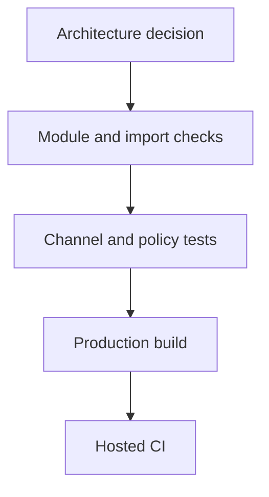

# Adoption And Enforcement

Architecture is a contract plus evidence that a project follows it. Human docs, skill guidance,
portable checks, enabled project configuration, production builds, and existing debt are separate
facts.

## Sources Of Truth

| Surface | Authority |
| --- | --- |
| `docs/architecture-contract.md` | human normative architecture |
| ADR 0001 | decision history, trade-offs, pilots, and acceptance |
| skill and references | agent procedure |
| `rules/` | executable portable invariants |
| `docs/evidence.md` | sources and measurements; does not create rules |
| target repository profile | concrete aliases, capabilities, stack, and stricter constraints |

A disagreement is a defect. Correct every affected surface rather than choosing the convenient one.

## Enforcement Floor

Portable tooling must protect seven invariants:

1. cross-capability imports use public root surfaces;
2. module dependencies remain acyclic;
3. domain and application code reject the framework/provider packages inventoried by the product
   profile;
4. browser code cannot import server surfaces;
5. public module files use the admitted runtime surface vocabulary;
6. admitted shared roots are runtime-specific and capability-neutral;
7. unresolved imports and hidden dynamic targets fail instead of bypassing the checks.

Each invariant needs one mutation that fails for the intended reason. Assertion count is not a
quality metric.

## What Static Rules Cannot Prove

Review and focused tests still decide:

- whether an operation passes the deletion test;
- whether a port speaks application language;
- whether a public surface actually narrows;
- whether shared semantics are identical;
- whether auth policy is correct;
- whether one failure is reported once;
- whether cache ownership is singular;
- whether a stream handles commit, cancellation, and resume correctly.

Do not add a syntactic proxy merely to claim these properties are linted.

## Boundary Violations

Do not escape a failed boundary with a deep relative import, barrel, re-export chain, duplicated
implementation, or broader shared folder.

Determine which statement is true:

1. the source belongs to another capability or role;
2. the target needs a narrow public surface;
3. the behavior names an orchestrating capability;
4. code is genuinely capability-neutral and passes shared admission;
5. the project profile needs a documented exception;
6. the architecture must intentionally change.

Move a file only when ownership changes. A re-export does not launder an illegal dependency.

## Adopt In An Existing Project

1. Inventory the current stack, routes, product capabilities, aliases, and server/client boundaries.
2. Preserve existing schema, form, UI, cache, and provider libraries.
3. Choose one complete capability as the pilot.
4. Record its current files and the touch set for one ordinary follow-up change.
5. Move product behavior under one module root without adding empty segments.
6. Publish only the runtime surfaces used by real consumers.
7. Enable module-boundary and server/client checks for the pilot.
8. Run type, lint, unit/integration, production build, and the real workflow.
9. Compare change radius, forwarding wrappers, auth/reporting duplication, and runtime behavior.
10. Accept, revise, or reject the architecture before migrating another capability.

Do not combine adoption with an unrequested framework or library migration.

## Incremental Migration

Released 1.x uses layer-first placement. Capability-first adoption is semver-major.

During migration:

- old and new capabilities may coexist behind an explicit boundary;
- one capability never uses both physical topologies internally;
- new capability code does not import old internals;
- adapters at the migration edge translate old public behavior to the new module surface;
- every migrated capability removes its obsolete old paths in the same change.

Do not create a permanent compatibility `lib` or `services` bucket.

## Product Profile

A consuming repository records:

- source roots and aliases;
- capability inventory;
- route-private and shared UI conventions;
- schema, form, cache, and notification libraries;
- store and remote-provider ownership;
- framework, database, telemetry, queue, and provider package roots used by import checks;
- auth and tenancy model;
- public surface and import-rule configuration;
- accepted migration debt with owner and removal condition.

The profile narrows portable guidance. It may be stricter but does not create a hidden second
architecture in agent-only instructions.

## Architecture Change

For an intentional change:

1. state the observable failure;
2. update the ADR or add a new one;
3. change human docs and agent guidance;
4. update executable rules only for properties they can prove;
5. add a failing mutation for each new enforced invariant;
6. add or revise behavior scenarios;
7. run runtime pilots when channel behavior changes;
8. run comparative agent evaluation when the skill's decision model changes;
9. inspect rendered diagrams and the complete diff;
10. verify local checks and hosted CI independently.

Release history belongs in `CHANGELOG.md`; implementation procedure belongs in references; evidence
belongs in `docs/evidence.md`.
