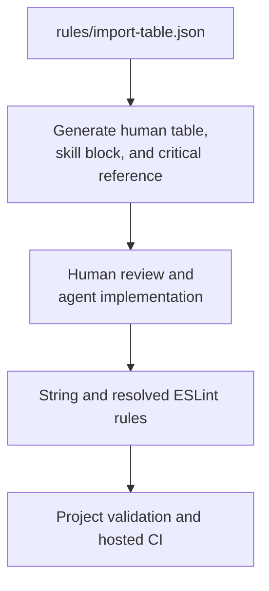

# Adoption And Enforcement

Architecture is a contract plus evidence that the contract is followed. Prose, generated tables,
lint capability, enabled project configuration, and existing code are separate facts.

## Sources Of Truth

| Surface | Authority |
| --- | --- |
| `docs/architecture-contract.md` | human architecture and placement rules |
| `rules/import-table.json` | executable layer roots, responsibilities, and import permissions |
| skill references | implementation procedures for coding agents |
| `docs/evidence.md` | measurements, sources, and decisions; it does not create rules |
| target repository instructions | product-specific names, profiles, exceptions, and stricter rules |

A disagreement between these surfaces is a defect. Do not choose the convenient version; correct
the source and regenerate every affected surface.

## Enforcement Status

| Contract area | Portable enforcement | Remaining obligation |
| --- | --- | --- |
| layer roots and import permissions | generated matrix across string and resolved ESLint tiers | enable both tiers in the target project |
| human and agent layer tables | generated from `import-table.json` | review responsibility wording with every architecture change |
| tagged reference examples | linted as the paths they claim to represent | add tags to every normative import example |
| skill/reference routing and links | repository validators | keep human-doc links in the same validation set |
| use-case depth and deletion test | scenario evaluation and review | prove the operation owns behaviour |
| port capability shape | scenario evaluation and review | reject CRUD- or SDK-shaped contracts |
| slice ownership and cross-slice isolation | convention only in the portable rules | add project-specific zones and inventory checks when required |
| auth, cache, transactions, and failure ownership | focused tests and review | verify runtime outcomes at the changed boundary |
| existing-stack profile | review gate | preserve established libraries and local architecture |

Green repository validation proves the shipped configuration is internally consistent. It does not
prove that a consuming project copied, enabled, or obeys the rules.

## Respond To A Boundary Violation

Do not escape a failed boundary with a deep relative import, re-export chain, runtime lookup,
duplicated implementation, or broader shared folder. Determine which statement is true:

1. the source has the wrong scope, slice, or layer;
2. the target exposes the wrong surface;
3. shared meaning belongs in `domain/**`;
4. cross-slice application behaviour needs a published operation;
5. the portable rules lack a project-specific scope or slice constraint;
6. the architecture must intentionally change.

Move a file only when its ownership changes. If the architecture changes, update the executable
contract, human docs, agent reference, scenarios, and representative project configuration
together.

## Known Portable Gaps

### Slice identity

Portable rules know layer roots but not project-specific slice names. They cannot prove that:

- a slice imports only another slice's public operation;
- an entry wraps its own slice's operation;
- every newly created slice has an isolation zone.

A strict project adds one resolved-path zone per slice and an inventory check that fails when a slice
directory has no zone. Without the inventory check, new slices fail open.

### Code outside layer roots

Files parked under an unclassified `src/lib/**` can launder dependencies because no layer rule owns
them. Treat `lib` as a migration bucket to empty, not a destination. A project may add an inventory
check requiring every source file to match a known layer root.

### Semantic depth

Path rules cannot detect:

- an operation that only forwards arguments;
- a port that mirrors a table or SDK;
- duplicated validation;
- two cache owners;
- duplicate telemetry;
- authorization derived from client input.

These remain explicit review and scenario checks.

## Adopt In An Existing Project

1. Inventory the current stack, source roots, aliases, server/client boundaries, and existing rules.
2. Map equivalent responsibilities before renaming folders or changing libraries.
3. Record intentional differences in the project's `AGENTS.md` or architecture document.
4. Copy `import-table.json` and both ESLint tiers.
5. Delete layer definitions for directories the project does not have.
6. Configure the resolver and keep `import/no-unresolved` enabled as the resolved-tier canary.
7. Run the generated import matrix before changing production code.
8. Classify existing violations as migration debt; do not silently weaken the target contract.
9. Migrate one complete slice, including tests and runtime boundaries.
10. Enable CI only after the profile and representative slice are verified.

Adoption is incremental. Do not combine an architecture migration with an unrequested framework,
schema, component-library, or state-management migration.

## Product Profile

The repository-level profile records:

- actual source roots and aliases;
- slice names and specificity scopes;
- data engines and remote providers;
- schema, form, component, cache, and notification libraries;
- auth and tenancy model;
- required project-specific zones;
- accepted migration debt with an owner and removal condition.

The profile narrows portable guidance. It may be stricter, but it must not create a hidden second
architecture in agent-only instructions.

## Change The Architecture

For an intentional contract change:

1. state the problem and the observable failure;
2. change `rules/import-table.json` when the rule is enforceable;
3. run `node scripts/validate-contract-sync.mjs --fix`;
4. update runtime or UI documentation when behaviour changes;
5. update the relevant reference and evaluation scenario;
6. add a mutation that fails when the old defect returns;
7. run `npm run validate`;
8. inspect rendered diagrams and the complete pull-request diff;
9. verify hosted CI independently from local checks.

Keep release history in `CHANGELOG.md`, implementation recipes in skill references, and measured
evidence in `docs/evidence.md`.
