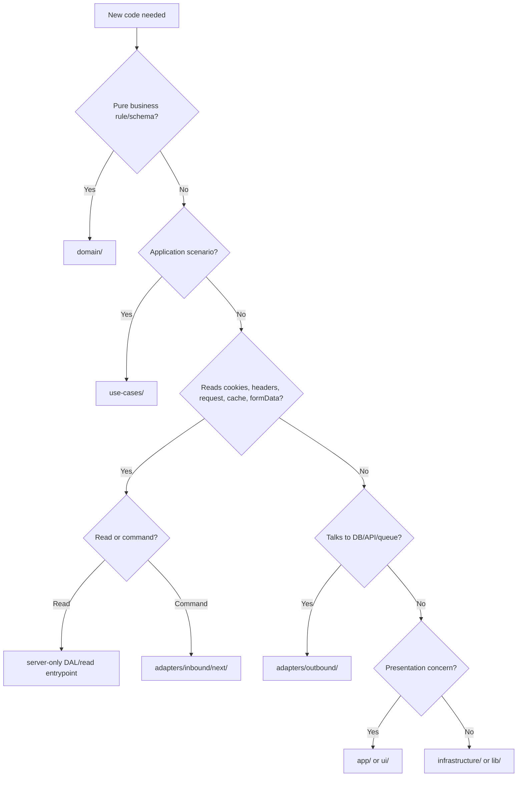
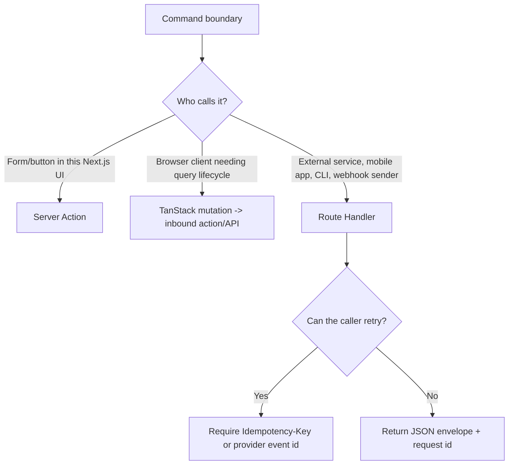
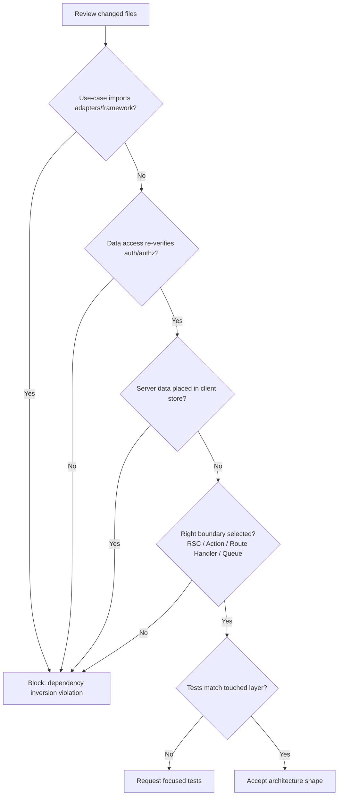

# Agent Decision Maps

Use these diagrams when prompting or reviewing coding agents. They are intentionally compact:
the goal is to force placement decisions before code changes, not to restate framework docs.

## Feature Slice Build Order

Arrows in this diagram mean implementation order, not import direction. See
[Architecture Contract](./architecture-contract.md) for dependency direction.

```mermaid
flowchart LR
  Domain["1 Domain\nschema + pure rules"] -->|build next| Ports["2 Use-case ports/types"]
  Ports -->|build next| UseCase["3 Use-case orchestration"]
  UseCase -->|build next| Outbound["4 Outbound adapter"]
  Outbound -->|build next| Inbound["5 Inbound adapter\nAction or Route Handler"]
  Inbound -->|build next| UIState["6 Server-state or local action"]
  UIState -->|build next| UI["7 UI component/page"]
  UI -->|build next| Tests["8 Tests by layer"]
```



Agent prompt guardrail:

> Implement in this order and stop if a lower layer needs to import a higher layer.

## Where Does This Code Go?



## Server Action vs Route Handler



## Review Checklist For Agent Output



## Minimal Agent Prompt Add-on

```text
Before editing, classify the change:
- layer: domain | use-case | outbound | inbound | server-state | UI | infrastructure
- boundary: RSC read | Server Action | Route Handler | webhook | durable job
- server data owner: RSC/DAL | TanStack Query | none
- auth boundary: where auth/authz is re-verified

Then implement in layer order. Do not import outbound adapters from use-cases.
```
