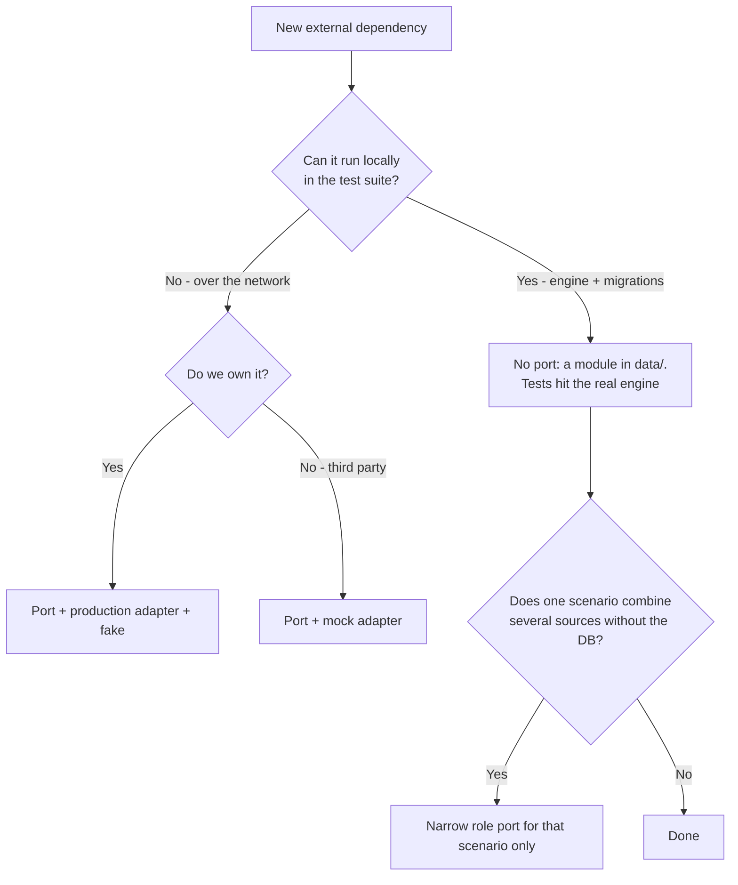
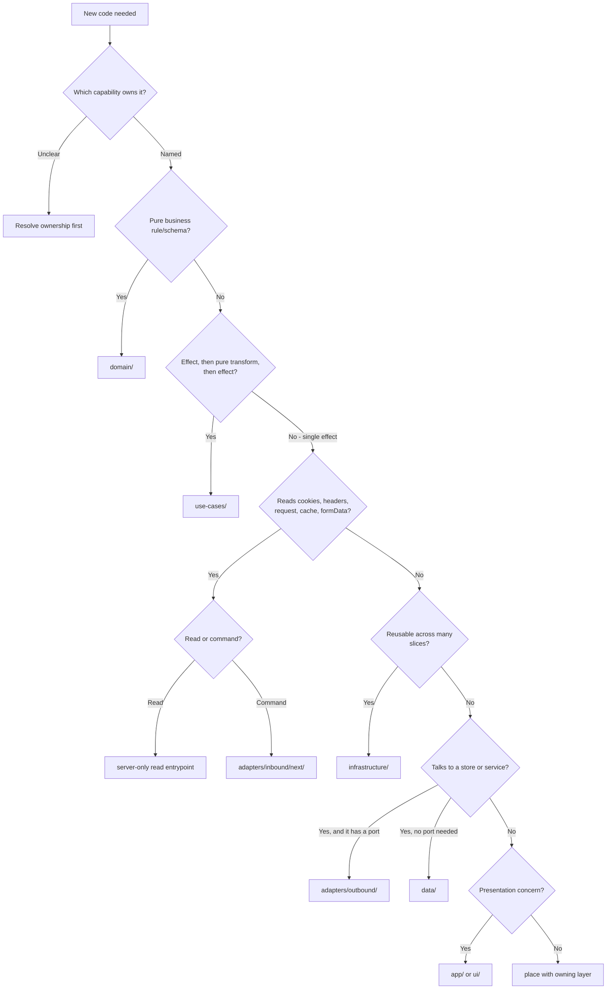
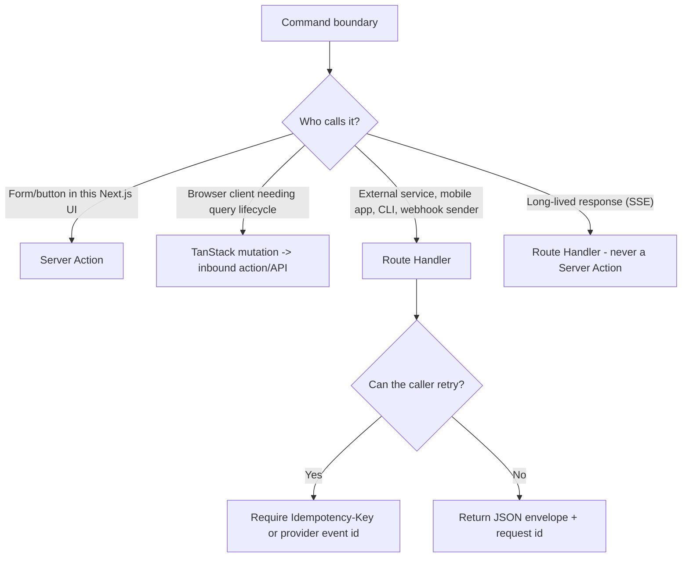
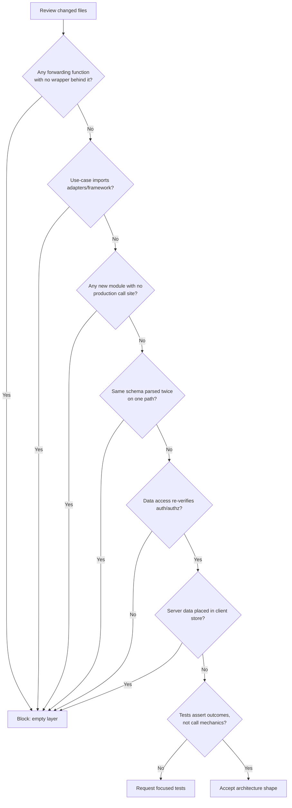

# Agent Decision Maps

Use these diagrams when prompting or reviewing coding agents. They are intentionally compact:
the goal is to force placement decisions before code changes, not to restate framework docs.

## Feature Slice Build Order

Arrows in this diagram mean implementation order, not import direction. See
[Architecture Contract](./architecture-contract.md) for dependency direction.


```mermaid
flowchart LR
  Domain["1 Domain\nschema + pure rules"] -->|build next| Seam["2 Seam decision\nport only if warranted"]
  Seam -->|build next| Data["3 Data module or adapter"]
  Data -->|build next| UseCase["4 Use-case\nonly if there is one"]
  UseCase -->|build next| Inbound["5 Inbound adapter\nAction or Route Handler"]
  Inbound -->|build next| UIState["6 Client cache or local action"]
  UIState -->|build next| UI["7 UI component/page"]
  UI -->|build next| Tests["8 Tests by layer"]
```

Two steps are conditional, and that is deliberate. A port exists only when the dependency
category calls for one; a use-case exists only when there is a pure transformation between
effects. Building either unconditionally is what produces layers full of forwarding.

Agent prompt guardrail:

> Implement in this order and stop if a lower layer needs to import a higher layer.

## Does This Dependency Get A Port?


```mermaid
flowchart TD
  Dep["New external dependency"] --> Cat{"Can it run locally\nin the test suite?"}
  Cat -->|"Yes - engine + migrations"| NoPort["No port: a module in data/.\nTests hit the real engine"]
  Cat -->|"No - over the network"| Owned{"Do we own it?"}
  Owned -->|Yes| Port["Port + production adapter + fake"]
  Owned -->|"No - third party"| Mock["Port + mock adapter"]
  NoPort --> Orchestrate{"Does one scenario combine\nseveral sources without the DB?"}
  Orchestrate -->|Yes| Narrow["Narrow role port for that scenario only"]
  Orchestrate -->|No| Done["Done"]
```

> A port whose only second implementation is a test mock is indirection, not a seam. When the
> real engine already runs locally, the port hides your own queries and a green suite can sit on
> a broken filter or a wrong policy.

## Where Does This Code Go?


```mermaid
flowchart TD
  Need["New code needed"] --> Owner{"Which capability owns it?"}
  Owner -->|Unclear| Stop["Resolve ownership first"]
  Owner -->|Named| Pure{"Pure business rule/schema?"}
  Pure -->|Yes| Domain["domain/"]
  Pure -->|No| Sandwich{"Effect, then pure transform,\nthen effect?"}
  Sandwich -->|Yes| UseCase["use-cases/"]
  Sandwich -->|"No - single effect"| Framework{"Reads cookies, headers,\nrequest, cache, formData?"}
  Framework -->|Yes| InboundOrRead{"Read or command?"}
  InboundOrRead -->|Read| ReadEntry["server-only read entrypoint"]
  InboundOrRead -->|Command| Inbound["adapters/inbound/next/"]
  Framework -->|No| Reusable{"Reusable across many\nslices?"}
  Reusable -->|Yes| Infra["infrastructure/"]
  Reusable -->|No| Persistence{"Talks to a store or service?"}
  Persistence -->|"Yes, and it has a port"| Outbound["adapters/outbound/"]
  Persistence -->|"Yes, no port needed"| Data["data/"]
  Persistence -->|No| Presentation{"Presentation concern?"}
  Presentation -->|Yes| UI["app/ or ui/"]
  Presentation -->|No| Place["place with owning layer"]
```

> Disambiguator: shared technical plumbing that serves no single capability (env validation,
> logger, cache tag taxonomy, query client setup) belongs in `infrastructure/`. Per-capability
> data access goes to `data/` when the dependency runs locally in the test suite and needs no
> port, and to `adapters/outbound/` when it sits behind one — see "Does This Dependency Get A
> Port?" above. Use-cases may import `data/`; an outbound adapter always arrives from the
> composition root.

## Server Action vs Route Handler


```mermaid
flowchart TD
  Command["Command boundary"] --> Caller{"Who calls it?"}
  Caller -->|Form/button in this Next.js UI| Action["Server Action"]
  Caller -->|Browser client needing query lifecycle| ClientCache["TanStack mutation -> inbound action/API"]
  Caller -->|External service, mobile app, CLI, webhook sender| Route["Route Handler"]
  Caller -->|"Long-lived response (SSE)"| Stream["Route Handler - never a Server Action"]
  Route --> Retry{"Can the caller retry?"}
  Retry -->|Yes| Idempotency["Require Idempotency-Key or provider event id"]
  Retry -->|No| Envelope["Return JSON envelope + request id"]
```

## Review Checklist For Agent Output


```mermaid
flowchart TD
  Start["Review changed files"] --> Forward{"Any forwarding function\nwith no wrapper behind it?"}
  Forward -->|Yes| Block["Block: empty layer"]
  Forward -->|No| Imports{"Use-case imports adapters/framework?"}
  Imports -->|Yes| Block
  Imports -->|No| Unused{"Any new module with no\nproduction call site?"}
  Unused -->|Yes| Block
  Unused -->|No| Twice{"Same schema parsed twice\non one path?"}
  Twice -->|Yes| Block
  Twice -->|No| Auth{"Data access re-verifies auth/authz?"}
  Auth -->|No| Block
  Auth -->|Yes| ServerData{"Server data placed in client store?"}
  ServerData -->|Yes| Block
  ServerData -->|No| Tests{"Tests assert outcomes,\nnot call mechanics?"}
  Tests -->|No| RequestTests["Request focused tests"]
  Tests -->|Yes| Accept["Accept architecture shape"]
```

## Copy This Block To Your Agent's System Prompt

> Paste verbatim into the system prompt, agent rules file, or CLAUDE.md instructions.
> It forces architecture classification before code edits, which catches misplaced files
> at planning time instead of review time.

```text
Before editing, classify the change:
- slice: which capability owns this behaviour
- layer: domain | use-case | data | outbound | inbound | read-entry | client-cache | UI | infrastructure
- dependency category: in-process | local-substitutable | remote-owned | external
- adapters today: how many implementations exist now
- behavior owned: what this module does that callers would otherwise repeat
- authority: store | owned service | application
- auth boundary: where the session and role are re-verified server-side
- boundary: RSC read | Server Action | Route Handler | stream | webhook | job
- cache owner: rsc | client-cache | shared-server-cache | none

Then implement in layer order. Do not import outbound adapters from use-cases.
If "behavior owned" is empty, do not create the module.
```

---

*Last reviewed against the live skill set: 2026-07-26 (skill version 2.0.0). When a skill rule
or template pattern changes, refresh this document in the same PR.*
