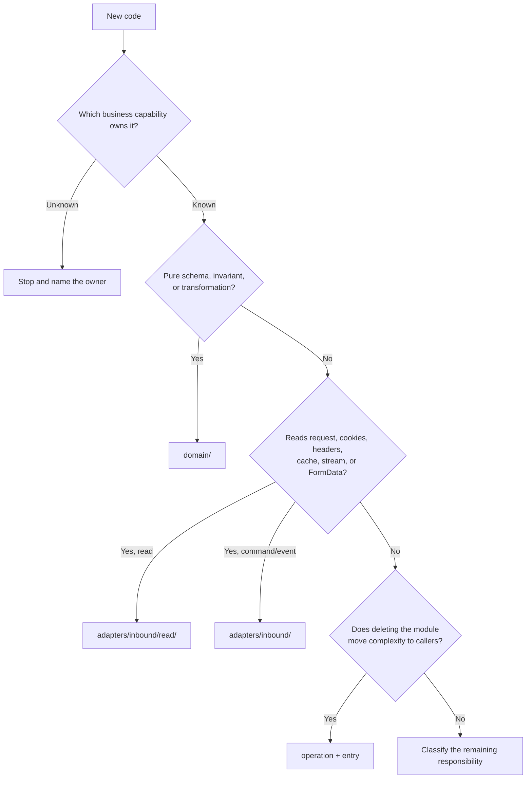
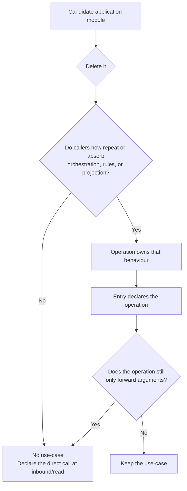
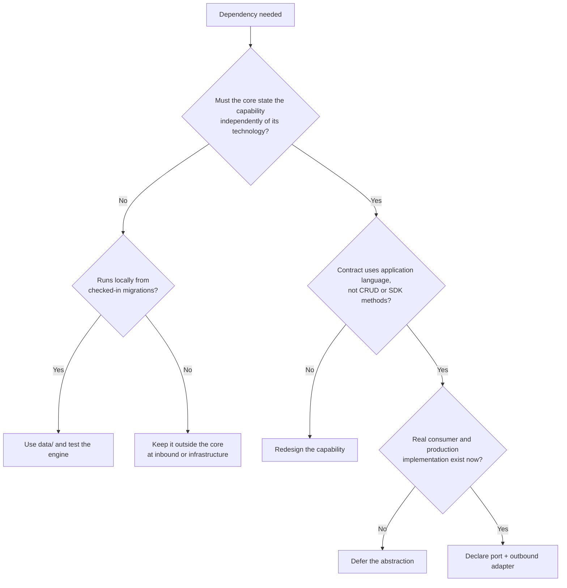
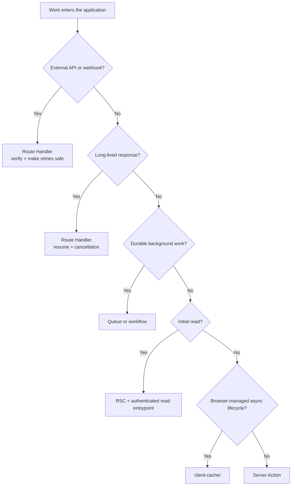
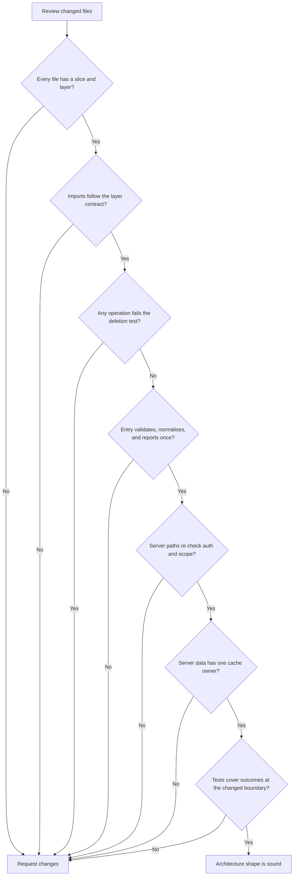

# Architecture Decision Maps

Use these maps during design and review. They derive from
[Architecture Contract](./architecture-contract.md); they do not define a second contract.

## Place New Code

```mermaid
flowchart TB
  Start["New code"] --> Owner{"Which business capability owns it?"}
  Owner -->|Unknown| Stop["Stop and name the owner"]
  Owner -->|Known| Pure{"Pure schema, invariant,\nor transformation?"}
  Pure -->|Yes| Domain["domain/"]
  Pure -->|No| Framework{"Reads request, cookies, headers,\ncache, stream, or FormData?"}
  Framework -->|Yes, read| Read["adapters/inbound/read/"]
  Framework -->|Yes, command/event| Inbound["adapters/inbound/"]
  Framework -->|No| Scenario{"Does deleting the module\nmove complexity to callers?"}
  Scenario -->|Yes| UseCase["operation + entry"]
  Scenario -->|No| Remaining["Classify the remaining responsibility"]
```

| Responsibility | Layer |
| --- | --- |
| Application capability contract | `ports/` |
| Local store access without a port | `data/` |
| Port implementation | `adapters/outbound/` |
| Shared application-boundary combinator | `boundary/` |
| Shared technical plumbing | `infrastructure/` |
| Presentation or browser lifecycle | `app/`, `ui/`, or `client-cache/` |

## Decide Whether A Use-Case Exists

```mermaid
flowchart TB
  Change["Candidate application module"] --> Delete{"Delete it"}
  Delete --> Repeat{"Do callers now repeat or absorb\norchestration, rules, or projection?"}
  Repeat -->|No| Remove["No use-case\nDeclare the direct call at inbound/read"]
  Repeat -->|Yes| Operation["Operation owns that behaviour"]
  Operation --> Entry["Entry declares the operation"]
  Entry --> Check{"Does the operation still\nonly forward arguments?"}
  Check -->|Yes| Remove
  Check -->|No| Keep["Keep the use-case"]
```

Line count is not the criterion. The question is whether the module owns behaviour.

## Decide Whether A Port Exists

```mermaid
flowchart TB
  Dependency["Dependency needed"] --> Independent{"Must the core state the capability\nindependently of its technology?"}
  Independent -->|No| Local{"Runs locally from\nchecked-in migrations?"}
  Local -->|Yes| Data["Use data/ and test the engine"]
  Local -->|No| Boundary["Keep it outside the core\nat inbound or infrastructure"]
  Independent -->|Yes| Language{"Contract uses application language,\nnot CRUD or SDK methods?"}
  Language -->|No| Redesign["Redesign the capability"]
  Language -->|Yes| Real{"Real consumer and production\nimplementation exist now?"}
  Real -->|No| Defer["Defer the abstraction"]
  Real -->|Yes| Port["Declare port + outbound adapter"]
```

Owned and third-party remote services normally follow the port path. A local store normally follows
the data path. These are defaults; the three questions decide.

## Choose The Framework Boundary

```mermaid
flowchart TB
  Need["Work enters the application"] --> External{"External API or webhook?"}
  External -->|Yes| Route["Route Handler<br/>verify + make retries safe"]
  External -->|No| Long{"Long-lived response?"}
  Long -->|Yes| Stream["Route Handler<br/>resume + cancellation"]
  Long -->|No| Durable{"Durable background work?"}
  Durable -->|Yes| Job["Queue or workflow"]
  Durable -->|No| Read{"Initial read?"}
  Read -->|Yes| RSC["RSC + authenticated read entrypoint"]
  Read -->|No| Browser{"Browser-managed async lifecycle?"}
  Browser -->|Yes| Cache["client-cache/"]
  Browser -->|No| Action["Server Action"]
```

Use `client-cache/**` only for realtime, polling, optimistic updates, infinite loading, or shared
browser cache lifecycle. A normal initial read stays server-side.

## Review A Change

```mermaid
flowchart TB
  Start["Review changed files"] --> Owner{"Every file has a slice and layer?"}
  Owner -->|No| Block["Request changes"]
  Owner -->|Yes| Imports{"Imports follow the layer contract?"}
  Imports -->|No| Block
  Imports -->|Yes| Empty{"Any operation fails the deletion test?"}
  Empty -->|Yes| Block
  Empty -->|No| Boundary{"Entry validates, normalises,\nand reports once?"}
  Boundary -->|No| Block
  Boundary -->|Yes| Auth{"Server paths re-check auth and scope?"}
  Auth -->|No| Block
  Auth -->|Yes| State{"Server data has one cache owner?"}
  State -->|No| Block
  State -->|Yes| Tests{"Tests cover outcomes at the changed boundary?"}
  Tests -->|No| Block
  Tests -->|Yes| Accept["Architecture shape is sound"]
```

For implementation details, use the matching skill reference. Do not copy these maps into
`AGENTS.md`, `CLAUDE.md`, or a system prompt; that creates another contract copy that will drift.
