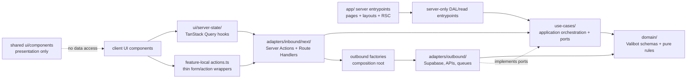
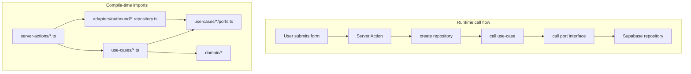
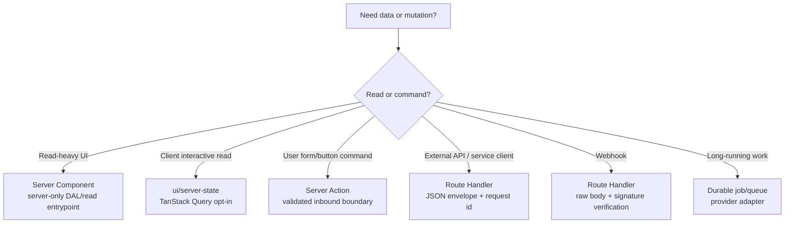
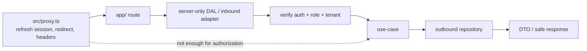
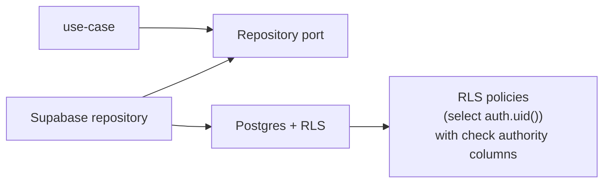
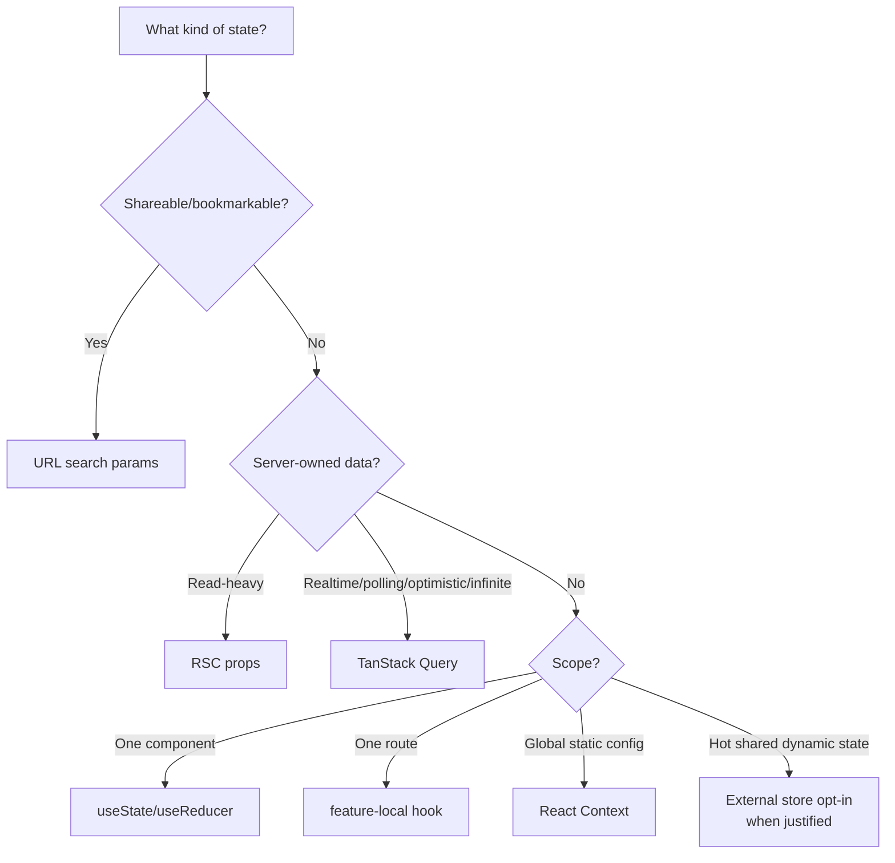

# Architecture Contract

This document is the human-readable model behind the `nextjs-architecture` and
`react-component-creator` skills. The skills are short operational guardrails; this document is
the rationale and visual map for teams.

## Purpose

The architecture combines Next.js App Router with ports-and-adapters discipline:

- Next.js owns routing, rendering, Server Actions, Route Handlers, and cache APIs.
- The application owns domain rules, use-cases, ports, adapters, and authorization decisions.
- Framework entrypoints compose dependencies; use-cases do not import framework or adapter code.

## Layer Dependency Graph

The important distinction: inbound adapters may create outbound implementations at runtime, but
use-cases must not import those implementations at compile time.

Forbidden imports:

- `domain/` must not import `app/`, `ui/`, use-cases, adapters, infrastructure, or framework APIs.
- `use-cases/` must not import inbound adapters, outbound adapters, Supabase clients, React,
  TanStack Query, or Next.js request/cache APIs.
- Client Components must not import server-only DAL modules, server Supabase clients, service-role
  clients, or secret-bearing env helpers.

## Runtime Flow vs Import Direction

This is why "inbound can call use-cases" is correct. The violation is the opposite direction:
use-cases importing inbound adapters, outbound repositories, Supabase clients, React, TanStack
Query, or Next.js request/cache APIs.

## Command And Query Boundaries

Server Actions are for UI commands. Route Handlers are for service APIs, webhooks, external
clients, mobile apps, integrations, and retryable HTTP commands.

## Security Boundary

`proxy.ts` is not the authorization boundary. Data access paths must re-check auth and return
DTOs rather than leaking raw database rows or service-role data.

## Persistence Boundary

Use-cases describe what persistence capability they need. Outbound adapters decide how Supabase,
RPCs, transactions, queues, or external APIs implement that capability.

## UI State Ownership

Do not put server data in Context, Zustand, or local state. Client stores own UI behavior, not
backend truth.

## What Belongs In Skills vs Docs

| Content | Put in skill references | Put in human docs |
| --- | --- | --- |
| Layer import contract | Yes | Yes |
| Decision tables used while coding | Yes | Yes |
| Rationale and diagrams | No | Yes |
| External API syntax | No | No, link to official docs |
| Long implementation walkthroughs | No | Sometimes, if onboarding needs it |
| Historical audit notes | No | Archive outside the plugin |
