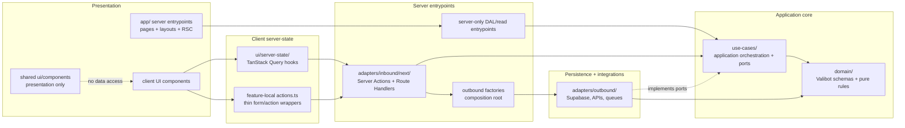
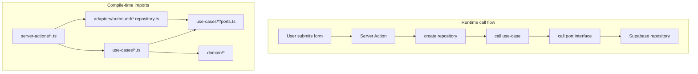
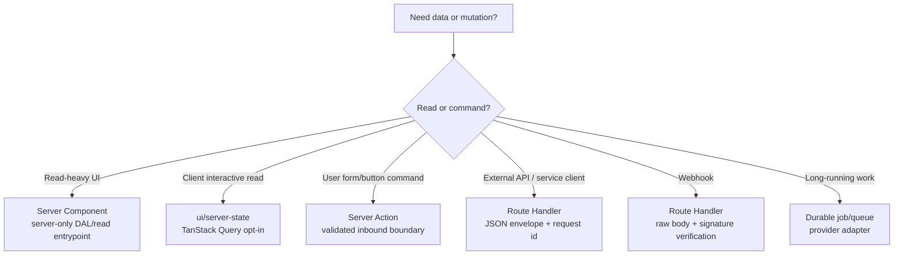
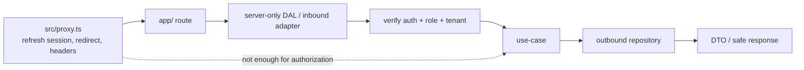
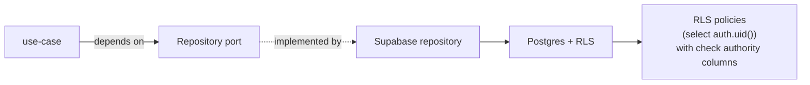

# Architecture Contract

This document is the human-readable model behind the `nextjs-architecture` and
`react-component-creator` skills. The skills are short operational guardrails; this document is
the rationale and visual map for teams.

> **Terms:** DAL, port, adapter, composition root, inbound, outbound, server-state — all
> defined in [`plugins/nextjs-clean-skills/skills/nextjs-architecture/references/glossary.md`](../plugins/nextjs-clean-skills/skills/nextjs-architecture/references/glossary.md).
> Open it side-by-side if any term feels unfamiliar.

## Purpose

The architecture combines Next.js App Router with ports-and-adapters discipline:

- Next.js owns routing, rendering, Server Actions, Route Handlers, and cache APIs.
- The application owns domain rules, use-cases, ports, adapters, and authorization decisions.
- Framework entrypoints compose dependencies; use-cases do not import framework or adapter code.

## Layer Dependency Graph

Nodes are grouped by the layer they belong to. Solid arrows are compile-time imports; the
dotted edge is a runtime relationship (implementation, not import).

The important distinction: inbound adapters may create outbound implementations at runtime, but
use-cases must not import those implementations at compile time.

### Why these imports are forbidden

The skill references list these as rules. The point of this section is to explain **why** —
so that next year, when someone is tempted to "just import this Supabase client into a
use-case for convenience", the rationale is preserved.

- **`domain/` imports nothing project-specific.** Schemas and pure rules must remain framework-
  agnostic so they keep working across Edge runtime, Node runtime, tests, future workers, and
  any future deploy target. The day a Valibot schema imports `next/headers`, you can no longer
  unit-test domain logic without a Next.js request context, and you cannot reuse the schema in
  a queue worker or a CLI.

- **`use-cases/` cannot import adapters or framework APIs.** Use-cases describe *what* needs
  to happen; ports describe *what capability* is needed; adapters decide *how* it is provided.
  If a use-case imports a concrete Supabase repository, you can no longer swap it for Drizzle
  or REST in tests or in another deployment without rewriting business rules. The same logic
  blocks `react`, `next/cache`, `next/headers`, TanStack Query, and clocks: each of them ties
  application logic to a specific runtime instead of a port.

- **Client Components cannot import server-only modules.** `import 'server-only'` is a build-
  time guard against accidentally bundling secrets, service-role clients, or cookie/session
  decoders into the browser. A single forbidden import can leak a service-role key into the
  public JS bundle.

- **Inbound adapters MAY import outbound factories.** This is the composition root: someone
  has to wire a concrete Supabase repository into a use-case at runtime. Server Actions and
  Route Handlers are the natural place for that wiring. The rule is one-way — outbound adapters
  never import inbound, and use-cases never import either.

## Runtime Flow vs Import Direction

This is why "inbound can call use-cases" is correct. The violation is the opposite direction:
use-cases importing inbound adapters, outbound repositories, Supabase clients, React, TanStack
Query, or Next.js request/cache APIs.

## Command And Query Boundaries

Server Actions are for UI commands. Route Handlers are for service APIs, webhooks, external
clients, mobile apps, integrations, and retryable HTTP commands.

## Security Boundary

`proxy.ts` is not the authorization boundary. Data access paths must re-check auth and return
DTOs rather than leaking raw database rows or service-role data.

## Persistence Boundary

Read the dotted edge as "is satisfied by" — the use-case never knows about the Supabase
repository, only its port. The adapter sits below the port and implements it.

Use-cases describe what persistence capability they need. Outbound adapters decide how Supabase,
RPCs, transactions, queues, or external APIs implement that capability.

## UI State Ownership

Do not put server data in Context, Zustand, or local state. Client stores own UI behavior, not
backend truth.

## What Belongs In Skills vs Docs

| Content | Put in skill references | Put in human docs |
| --- | --- | --- |
| Layer import contract | Yes | Yes |
| Decision tables used while coding | Yes | Yes |
| Rationale and diagrams | No | Yes |
| External API syntax | No | No, link to official docs |
| Long implementation walkthroughs | No | Sometimes, if onboarding needs it |
| Historical audit notes | No | Archive outside the plugin |

---

*Last reviewed against the live skill set: 2026-05-03 (skill version 1.1.0). When a skill rule
or template pattern changes, refresh this document in the same PR.*
