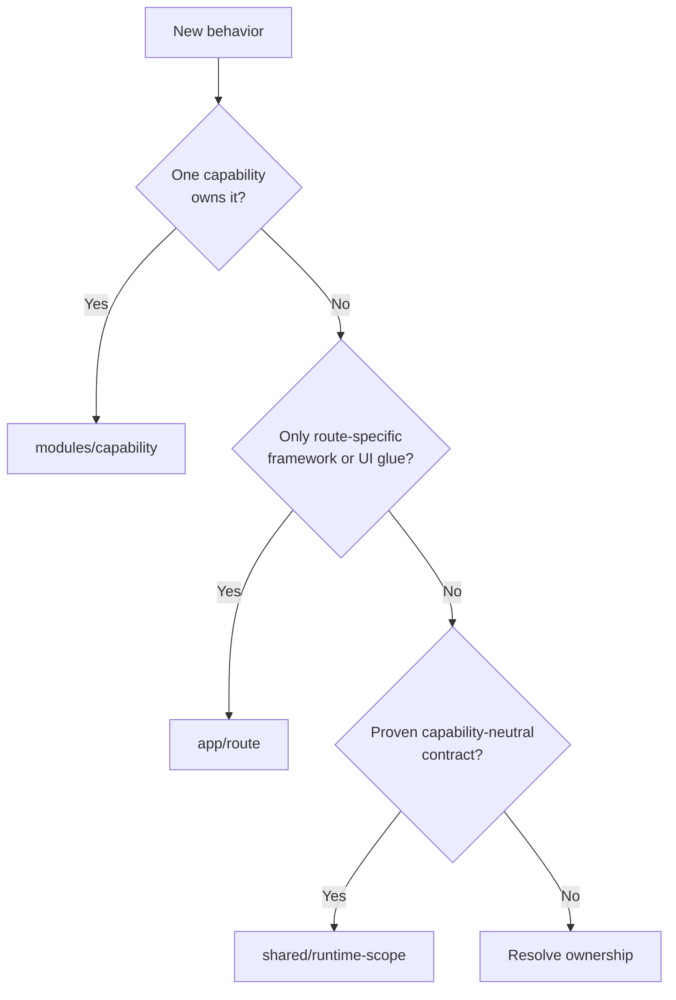
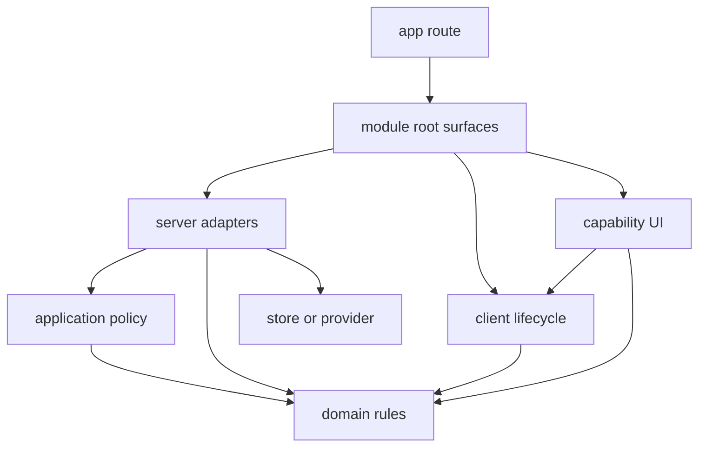
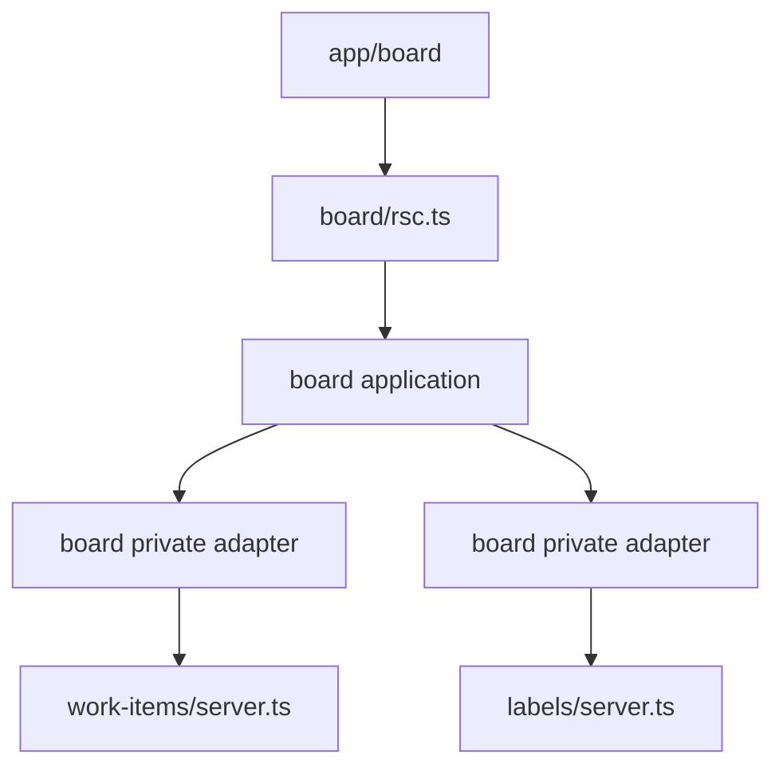

# Architecture Contract

This is the human-readable architecture behind `designing-nextjs-capabilities` and
`creating-react-components`. It defines ownership, placement, dependency direction, and public
surfaces. Runtime behavior is specified in [Runtime Boundaries](./runtime-boundaries.md).

The default profile is Next.js App Router with TypeScript. Existing projects keep equivalent
libraries and names unless a migration is explicitly requested.

## Quality Goals

| Goal | Architectural response |
| --- | --- |
| local reasoning | keep one product capability under one discoverable root |
| change isolation | forbid imports of another capability's internals |
| semantic depth | add application operations and ports only when they own real behavior |
| runtime safety | separate server, browser, and framework entry surfaces |
| security | enforce identity, policy, and store predicates at their own boundaries |
| evolvability | keep framework and provider details outside domain and application policy |

Folders do not produce these properties automatically. A rule is useful only when its failure mode
and verification are named.

Two rules are verified by review rather than by machine: the capability boundary and public API
admission. Machine checks enforce a boundary once chosen; they cannot discover the right capability
or public contract.

## Physical Model

Product behavior lives under one capability root:

```text
src/modules/<capability>/
```

Framework routes, metadata, layouts, and route-private presentation remain under `src/app/**`.
Capability-neutral code must pass the shared-admission gate before entering `src/shared/**`.
These are default paths, not hidden assumptions in the tooling. A product records `sourceRoot`,
`moduleRoot`, `appRoot`, `sharedRoot`, and `importAliases` in
`rules/architecture-contract.json`; aliases also remain configured in `tsconfig.json`. Alias
prefixes must end with `/` — `"@"` would claim every package name starting with `@`, and the tools
refuse that shape instead of resolving it.


```mermaid
flowchart TB
  accTitle: Primary placement decision
  accDescr: Product behavior goes to an owning capability, route-only composition stays under app, and proven capability-neutral code may enter an admitted shared root.
  Change["New behavior"]
  Owner{"One capability<br/>owns it?"}
  Module["modules/capability"]
  Route{"Only route-specific<br/>framework or UI glue?"}
  App["app/route"]
  Shared{"Proven capability-neutral<br/>contract?"}
  SharedRoot["shared/runtime-scope"]
  Stop["Resolve ownership"]

  Change --> Owner
  Owner -->|Yes| Module
  Owner -->|No| Route
  Route -->|Yes| App
  Route -->|No| Shared
  Shared -->|Yes| SharedRoot
  Shared -->|No| Stop
```

Do not create a module for a page, table, transport, or provider. Name the product capability whose
policy and vocabulary the code serves.

### Capability Granularity

A capability is a coherent product goal with its own vocabulary, policy, and lifecycle. The module
boundary follows a present product distinction, not a storage or screen boundary.

| Keep together when | Split when |
| --- | --- |
| concepts serve the same actor goal and business outcome | actor goals or business outcomes differ |
| authorization consequences and lifecycle are shared | policy, authorization consequences, or lifecycle diverge |
| the same owner changes the concepts together | change authority is independent |
| consumers need one capability contract | a narrower stable contract can hide the other capability's internals |

A table, CRUD screen, route, provider, dedicated role check, file count, or size threshold is not a
boundary by itself. Related lookup entities should remain in their owning taxonomy or workflow
capability until the product supplies an independent goal, policy, lifecycle, or contract.

This is a review-only decision. Reviewers name the actor goal, outcome, policy, lifecycle, change
authority, and public contract that justify keeping or splitting the concepts. Path rules enforce
the resulting ownership boundary; they cannot discover that boundary.

## Optional Internal Segments

A capability may use these reserved segments:

| Segment | Owns | Create when |
| --- | --- | --- |
| `domain/` | pure invariants, calculations, and domain values | a rule exists independently of framework and I/O |
| `application/` | policy, orchestration, projection, and owned ports | behavior passes the deletion test |
| `server/` | private server adapters, persistence modules, providers, and cache wiring | the capability performs server I/O |
| `client/` | browser async lifecycle, realtime, polling, and optimistic state | the browser owns that lifecycle |
| `ui/` | reusable capability presentation and interaction | more than route-private rendering is required |

Segments are optional. Empty segments and placeholder files are invalid. The smallest valid module
may be one private server file plus one public server surface.

Roles are architectural even when a tiny module keeps several roles in one file. Split a segment
when the split makes a dependency rule or responsibility clearer, not to complete a template.

## Public Surfaces

Other capabilities and `app/**` import runtime-specific root files, never internal directories:

```text
src/modules/work-items/
├── domain/            # optional, private
├── application/       # optional, private
├── server/            # optional, private
├── client/            # optional, private
├── ui/                # optional, private
├── server.ts          # silent trusted composition API with explicit identity
├── rsc.ts             # current-request RSC read surface
├── actions.ts         # top-level 'use server'; UI commands
├── client.ts          # browser-safe read or subscription surface
├── ui.ts              # reusable capability UI
├── query-cache.ts     # shared serializable query-key identity for prefetch and hydration
├── stream.ts          # stream-channel contract
└── job.ts             # worker contract
```

This is a vocabulary, not a required tree. Create only surfaces with real consumers.

Keep a root surface as a small explicit export manifest when implementation grows: split private
implementation under its segment and publish named contracts from the root. Do not split a
capability merely to reduce file size. If one runtime surface develops independently meaningful
contract groups, record an architecture change before introducing public subpaths; deep imports are
not an accidental scaling mechanism.

A public surface is valid only when it does at least one of these:

1. publishes an explicit stable API for named consumers;
2. strengthens or translates a contract;
3. establishes a runtime boundary.

A root public surface may use named re-exports when its exported contracts are already stable, safe
for that surface's own runtime, free of provider shapes, and explicit about their identity
requirements. `export *` is not a public contract. When private exports carry provider shapes,
values bound to a runtime other than the surface's own, implicit identity requirements, or unstable
implementation details, the surface defines and translates to a public contract rather than
re-exporting them.

Public API admission is review-only. Reviewers name the consumers and explain why each exported
concept or contract group belongs to the public contract.

A one-to-one rename or re-export does not justify a new facade, operation, or wrapper. A one-to-one
channel wrapper is valid only when it establishes real runtime behavior such as authentication,
validation, failure translation, or telemetry ownership.

`actions.ts` is a compiler-constrained exception. With top-level `'use server'`, every value export
must be an async function declared in that file. Import the private implementation and call it from
the local action; do not value-re-export it. Type-only re-exports remain allowed.

`query-cache.ts` is the one runtime-neutral exception to the channel-specific vocabulary. It exists
only when the same serializable TanStack Query key identity has both a server prefetch/hydration
consumer and a browser query consumer. It imports only its own `domain/**` or `shared/kernel`.
Next.js cache tags, invalidation, fetchers, providers, and one-runtime-only keys stay private in
`server/**` or `client/**`.

## Dependency Direction

The module is the unit of ownership. Segments express dependency direction inside that unit.


```mermaid
flowchart TB
  accTitle: Capability dependency direction
  accDescr: Framework entrypoints consume public capability surfaces; private server and client adapters depend inward on application and domain policy.
  App["app route"]
  Public["module root surfaces"]
  Server["server adapters"]
  Client["client lifecycle"]
  UI["capability UI"]
  Application["application policy"]
  Domain["domain rules"]
  External["store or provider"]

  App --> Public
  Public --> Server
  Public --> Client
  Public --> UI
  Server --> Application
  Server --> Domain
  Server --> External
  Client --> Domain
  UI --> Client
  UI --> Domain
  Application --> Domain
```

Normative rules:

1. `app/**` imports module root surfaces, not module internals.
2. A capability imports another capability only through its root public surface.
3. Module dependencies are acyclic.
4. `domain/**` is pure and imports only its own domain, admitted `shared/kernel`, or dependencies
   explicitly classified by the product as pure.
5. `application/**` imports its domain, pure helpers, and capability-owned port types. It imports
   no Next.js, React, database SDK, provider SDK, or concrete adapter.
6. `server/**` implements server-side driving and driven adapters for its capability.
   It does not import its own root public surfaces; `server.ts`, `rsc.ts`, and `actions.ts` depend
   inward on private server implementation.
7. `client/**` imports only browser-safe values and the exact `actions.ts` mutations it needs.
8. `ui/**` imports its own domain/client values and, when required, its exact action surface. It
   never imports `server.ts`, `rsc.ts`, or `server/**`.
9. Both server and browser paths may import `query-cache.ts`; it cannot import runtime code and is
   invalid with consumers on only one side.
10. `server-only` and `client-only` protect runtime modules in addition to path rules.
11. A production build must fail when a Client Component imports a server surface.
12. Every direct runtime dependency is classified as pure or runtime-bound; unclassified packages
    fail closed until the product updates its contract.
13. Literal database resources are declared with an owner. Undeclared, dynamic, or unauthorized
    `.from()`/`.rpc()` calls fail the portable Supabase ownership canary.

Within one capability, channel roots such as `rsc.ts` and `actions.ts` may call its trusted
`server.ts` surface or the same private composition. This is inward reuse, not a license for
`app/**` or another capability to import `server/**`. Cross-capability application ports declare
their own types; private server adapters map other capabilities' public contracts into them.

The `actions.ts` import from browser code is a deliberate framework boundary, not permission to
import arbitrary server modules.

The dependency classifier is exhaustive for direct `package.json` dependencies. The runtime list is
still project-owned because static analysis cannot infer whether a package is pure. This turns a new
provider package into a required decision instead of silently allowing it into domain/application.

The database resource check sees literal Supabase `.from()` and `.rpc()` calls only when the
receiver contains an identifier listed in `databaseClientIdentifiers`. This avoids treating every
same-named method as Supabase while keeping the canary explicit and reviewable. It does not trace
renamed clients, parse raw SQL, ORM queries, views reached indirectly, migrations, or dynamic
provider abstractions. RLS, explicit grants, migration review, and integration tests remain
separate guarantees.

## Application Operations

Create an application operation only when deleting it moves meaningful complexity into callers.
Qualifying behavior includes:

- policy or branching not owned by a store;
- orchestration across effects or capabilities;
- a projection that combines sources;
- transaction intent;
- behavior shared by multiple runtime channels.

Simple store-backed CRUD may be:

```text
channel boundary -> capability server service -> private store
```

Real application behavior is:

```text
channel boundary -> application operation -> explicit dependencies
```

An operation is framework-neutral, reports nothing, and receives the smallest dependency object it
uses. Input validation, row mapping, cache invalidation, telemetry, or an ordinary uniqueness
conflict do not by themselves justify a forwarding operation.

Do not invent persistence, alternate providers, coordination, or reuse to make an operation look
necessary.

## Ports

A port belongs to the application behavior that needs it:

```text
modules/<owner>/application/ports/<capability>.ts
```

Create one only when all are true:

1. application behavior must name a capability independently of technology;
2. the contract is written in application language, not CRUD or SDK vocabulary;
3. inversion protects real volatility, ownership, or isolation;
4. a production consumer exists now.

Adapter count, locality, and test doubles are evidence, not gates. A local store can remain a
private driven adapter without a mirrored repository interface. A remote provider can warrant a
port with one implementation when the application must speak its capability independently.

## Cross-Capability Workflows

An outer route may wire existing behavior but may not own meaningful product policy.

Create an orchestrating capability when deleting cross-capability code would move filtering,
grouping, authorization consequences, projection, transaction intent, or coordination into a
route or sibling capability. One current route consumer is enough when the policy is real.


```mermaid
flowchart TB
  accTitle: Cross-capability orchestration
  accDescr: A board capability owns board policy and adapts narrow public server surfaces from work-items and labels without coupling those source capabilities.
  Route["app/board"]
  BoardSurface["board/rsc.ts"]
  BoardOperation["board application"]
  WorkAdapter["board private adapter"]
  LabelAdapter["board private adapter"]
  WorkPublic["work-items/server.ts"]
  LabelPublic["labels/server.ts"]

  Route --> BoardSurface
  BoardSurface --> BoardOperation
  BoardOperation --> WorkAdapter
  BoardOperation --> LabelAdapter
  WorkAdapter --> WorkPublic
  LabelAdapter --> LabelPublic
```

The orchestrator owns dependencies in its own language. Private adapters call narrow public
surfaces of source capabilities. Source capabilities do not import the orchestrator or one another.
Their trusted `server.ts` surfaces accept explicit identity, enforce their own policy, and remain
silent so the outer runtime channel owns the one unexpected-error report.

Sequence dependent calls. If label IDs come from work-items, load work-items before labels.
Authorization-sensitive joins require a complete resolution result that distinguishes visible,
missing, and forbidden references without exposing sensitive existence. Silent omission is not a
valid substitute for a required rejection.

## Shared Admission

Allowed shared roots are runtime-specific:

```text
shared/kernel
shared/server
shared/client
shared/ui
```

Admission requires:

1. at least two real capability consumers;
2. identical meaning and lifecycle;
3. no natural capability owner;
4. a named maintainer and narrow contract;
5. copying is now more expensive than coordinating the shared contract.

`shared/kernel` is stricter: terminology, invariants, and change cadence must also be identical.
Similar names such as `Email`, `TenantId`, or `Money` are insufficient.

Demote shared code when consumers diverge or one capability becomes the natural owner. Broad
`utils`, `services`, or migration buckets are invalid.

## Reference Capability

This example shows ownership, not mandatory files:

```text
src/
├── app/work-items/
│   ├── page.tsx
│   └── _components/
├── modules/work-items/
│   ├── domain/
│   ├── application/
│   ├── server/
│   ├── client/
│   ├── ui/
│   ├── server.ts
│   ├── rsc.ts
│   ├── actions.ts
│   ├── client.ts
│   └── ui.ts
└── shared/
    ├── kernel/
    ├── server/
    ├── client/
    └── ui/
```

A simple CRUD capability omits `application/`. An RSC-only capability omits `client/`,
`client.ts`, and `actions.ts`. Route-private UI remains under `app/**`.

## Non-Goals

This architecture does not require:

- a DI container;
- a port per table;
- a use-case per endpoint;
- every optional segment;
- TanStack Query for every read;
- a universal result wrapper;
- a generic shared library.

Continue with [Runtime Boundaries](./runtime-boundaries.md) for channels, trust, failures, cache,
transactions, and testing. Use [Frontend Composition](./frontend-composition.md) for RSC, Client
Components, forms, state, and UI ownership.
