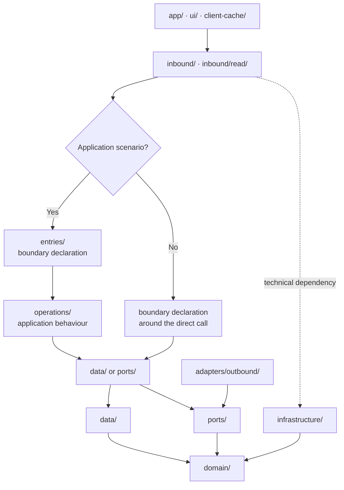
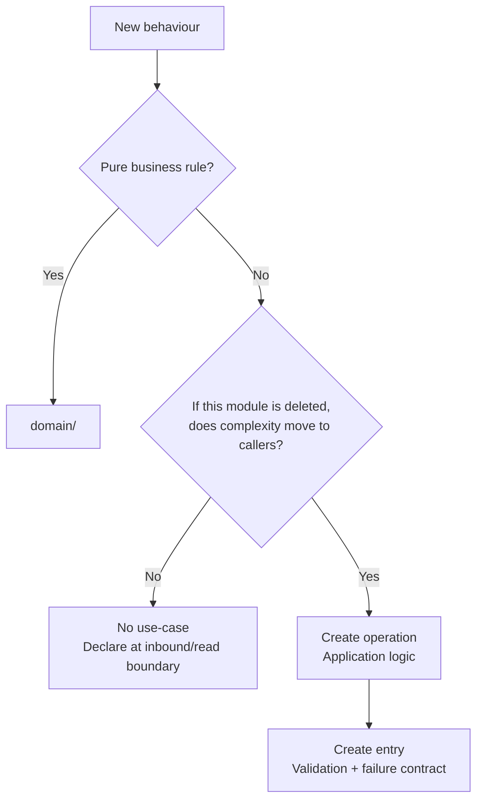
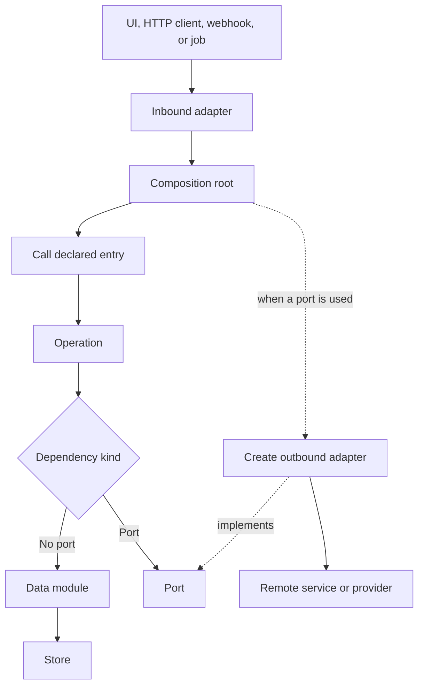
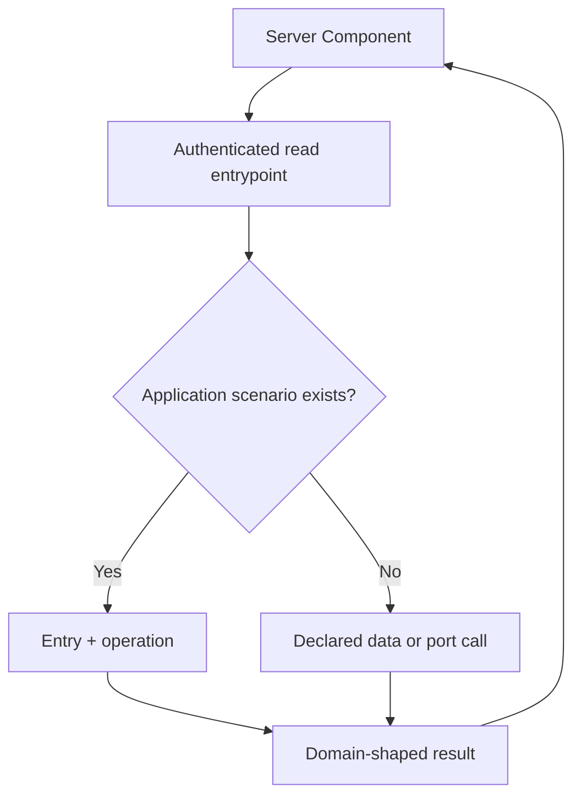

# Architecture Contract

This is the human-readable architecture behind `nextjs-architecture` and
`react-component-creator`. It defines ownership and dependency direction. Skill references contain
the implementation procedures.

The default profile is Next.js App Router with TypeScript. Existing projects keep equivalent tools
and names unless a migration is explicitly requested.

## Model

Every file has two coordinates:

- **Slice:** the business capability that owns the behaviour.
- **Layer:** the responsibility the file performs.

Slices are vertical: `work-items`, `campaigns`, `chat`. Layers are horizontal: domain, application,
adapters, and presentation. A file with no clear slice or layer is not ready to be created.

## Compile-Time Dependencies

Arrows mean imports. Runtime calls are shown separately.

```mermaid
flowchart TB
  Presentation["app/ · ui/ · client-cache/"] --> Delivery["inbound/ · inbound/read/"]
  Delivery --> Scenario{"Application scenario?"}
  Scenario -->|Yes| Entries["entries/<br/>boundary declaration"]
  Entries --> Operations["operations/<br/>application behaviour"]
  Scenario -->|No| Direct["boundary declaration<br/>around the direct call"]
  Operations --> Access["data/ or ports/"]
  Direct --> Access
  Access --> Data["data/"]
  Access --> Ports["ports/"]
  Data --> Domain
  Ports --> Domain["domain/"]
  Outbound["adapters/outbound/"] --> Ports
  Delivery -. "technical dependency" .-> Infrastructure["infrastructure/"]
  Infrastructure --> Domain
```

The diagram shows the main direction, not every legal edge. The table below and the generated
reference contain the exact import contract.

The complete enforced matrix is in
[`references/placement/layers-and-imports.md`](../plugins/nextjs-clean-skills/skills/nextjs-architecture/references/placement/layers-and-imports.md).
The rules with the highest architectural weight are:

| Source | May import | Must not do |
| --- | --- | --- |
| `domain/**` | schema libraries and pure helpers | perform I/O or import project layers |
| `operations/**` | domain, ports, data | import framework, adapters, boundary, or entries |
| `entries/**` | domain, boundary, its operation | call data, ports, adapters, or another entry |
| `data/**` | domain | become an adapter without a port |
| `adapters/outbound/**` | domain, ports | declare boundaries or import use-cases |
| inbound and read entrypoints | entries, data, outbound factories, infrastructure | move application rules into request code |
| `client-cache/**` | domain, inbound | import server-only implementation layers |
| `app/**` and `ui/**` | public entrypoints and presentation dependencies | bypass inbound or read boundaries |

`operations/**` is the only public cross-slice application surface. An entry wraps its own
operation. The shipped portable lint enforces the layer split but cannot compare source and target
slice names; projects that require hard slice isolation add project-specific zones.

## When A Use-Case Exists

A use-case exists only when deleting it would move meaningful complexity into its callers.

The deletion test may pass because the module owns:

- orchestration across multiple effects or capabilities;
- an application rule not owned by the store;
- a projection combining multiple sources;
- application behaviour shared by multiple inbound boundaries.

A storage call with a new name is not a use-case. If no scenario exists, the inbound or read
entrypoint declares the contract directly around the data or port call.

```mermaid
flowchart TB
  Change["New behaviour"] --> Pure{"Pure business rule?"}
  Pure -->|Yes| Domain["domain/"]
  Pure -->|No| Delete{"If this module is deleted,<br/>does complexity move to callers?"}
  Delete -->|No| Direct["No use-case<br/>Declare at inbound/read boundary"]
  Delete -->|Yes| Operation["Create operation<br/>Application logic"]
  Operation --> Entry["Create entry<br/>Validation + failure contract"]
```

## When A Port Exists

A port is an application-owned capability contract. It is not a repository interface created for
every stored entity.

Declare a port when all of these hold:

1. The core needs the capability independently of a specific technology or provider.
2. The contract is written in application language, not CRUD or SDK language.
3. A real consumer and production implementation exist now.

Defaults:

| Dependency | Default |
| --- | --- |
| Pure in-process computation | ordinary module |
| Store runnable from checked-in migrations | `data/**`, tested against the real engine |
| Owned remote service | port plus outbound adapter |
| Third-party service | port plus outbound adapter |

Adapter count is evidence, not a gate. A test adapter is useful only when it preserves the contract;
integration tests against the real engine or provider boundary still remain.

## Declaration And Operation

An **operation** contains typed application logic. It may throw typed application failures and
never reports them.

An **entry** declares an operation through the shared boundary combinator. The declaration:

1. validates input and output;
2. normalises failures into the public result;
3. reports an unexpected failure once;
4. removes sensitive fields before telemetry.

Framework control flow stays outside the declaration. `redirect()` and `notFound()` are called by
the framework entrypoint after it receives the result.

Declarations never call declarations. Composition uses operations and receives one outer
declaration.

## Runtime Flows

The framework entrypoint is the composition root. It creates outbound implementations and supplies
them to operations through port-shaped dependencies.

```mermaid
flowchart TB
  Caller["UI, HTTP client, webhook, or job"] --> Inbound["Inbound adapter"]
  Inbound --> Compose["Composition root"]
  Compose --> Entry["Call declared entry"]
  Compose -. "when a port is used" .-> Adapter["Create outbound adapter"]
  Entry --> Operation["Operation"]
  Operation --> Dependency{"Dependency kind"}
  Dependency -->|No port| Data["Data module"]
  Dependency -->|Port| Port["Port"]
  Adapter -. "implements" .-> Port
  Data --> External["Store"]
  Adapter --> ExternalSystem["Remote service or provider"]
```

Reads follow the same ownership rules without forcing every read through a use-case:

```mermaid
flowchart TB
  RSC["Server Component"] --> Read["Authenticated read entrypoint"]
  Read --> Scenario{"Application scenario exists?"}
  Scenario -->|Yes| Entry["Entry + operation"]
  Scenario -->|No| Direct["Declared data or port call"]
  Entry --> Result["Domain-shaped result"]
  Direct --> Result
  Result --> RSC
```

## Next.js Boundaries

| Need | Boundary |
| --- | --- |
| Read-heavy initial render | Server Component through a server-only read entrypoint |
| Realtime, polling, optimistic, infinite, or shared browser lifecycle | `client-cache/**` |
| Command from this UI | Server Action |
| External client or service API | Route Handler |
| Webhook | Route Handler with raw-body verification and idempotency |
| SSE or another long-lived response | Route Handler with resume and cancellation |
| Long-running durable work | Queue or workflow |

A Server Component does not call its own Route Handler over HTTP. Both call the same application
surface in process.

## Cross-Cutting Invariants

- Every read and write re-verifies identity, role, and tenant at the server boundary.
- `proxy.ts` may refresh or redirect; it is not the authorization boundary.
- Store policies are defence in depth, not the only authorization check.
- One failure produces one report and one public classification.
- Row types belong to data or adapters; domain types do not mirror storage names.
- A stored function owns its transaction. The application does not reproduce it.
- Server data stays in RSC props or the client cache, not Context or a generic UI store.
- Cache keys and invalidation are scoped by entity, user, or tenant.

## Non-Goals

This architecture does not require a DI container, a port per table, a use-case per endpoint, or
TanStack Query for every read. It also does not define product-specific slice names. Those choices
must be justified by the application, not by the folder template.
