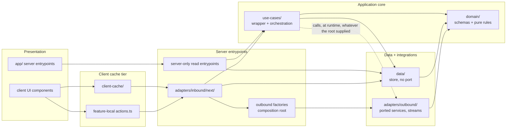
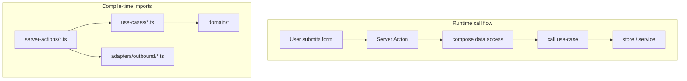
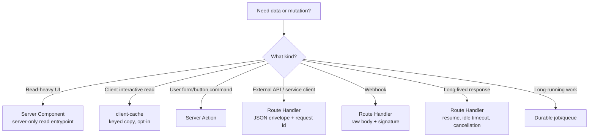
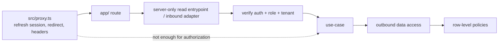
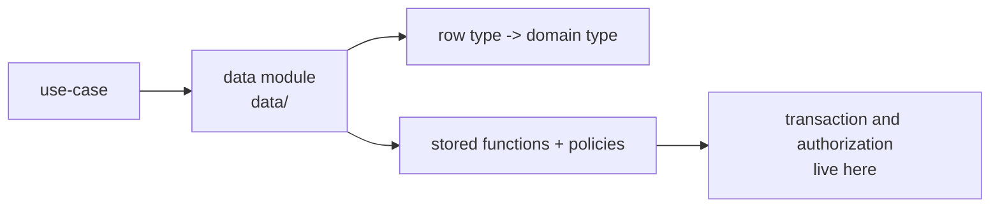
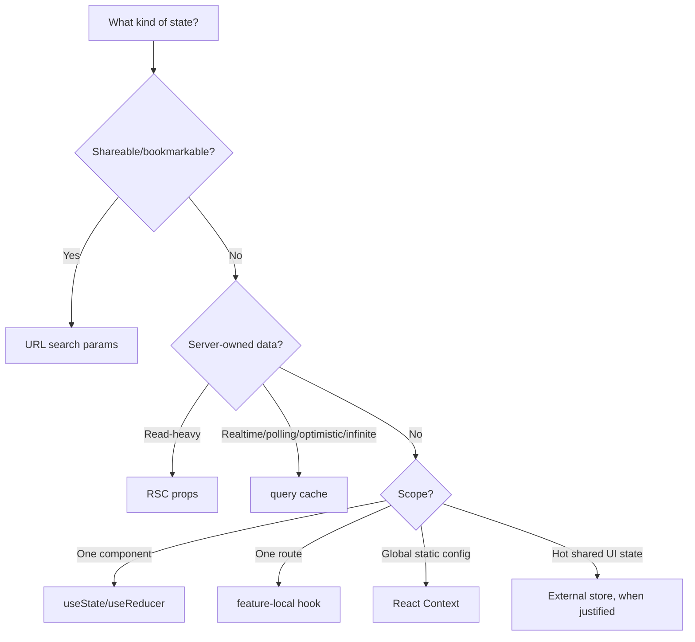

# Architecture Contract

This document is the human-readable model behind the `nextjs-architecture` and
`react-component-creator` skills. The skills are short operational guardrails; this document is
the rationale and visual map for teams.

> **Terms:** seam, port, adapter, dependency category, wrapper, read entrypoint, row type,
> client cache — all defined in [`glossary.md`](../plugins/nextjs-clean-skills/skills/nextjs-architecture/references/glossary.md).
> Open it side-by-side if any term feels unfamiliar.

> **Measurements:** where a rule came from a count rather than from a canonical source or from
> judgement, [Evidence](./evidence.md) records which, with the command that produced it.

## Purpose

The architecture combines Next.js App Router with ports-and-adapters discipline, applied to an
application whose **business authority usually sits behind a seam** — in stored functions plus
row-level policies, or in a separate service the team owns.

- Next.js owns routing, rendering, Server Actions, Route Handlers, and cache APIs.
- The application owns domain rules, scenario orchestration, seam contracts, and authorization
  decisions it can make before the store is reached.
- Framework entrypoints compose dependencies; use-cases do not import framework or adapter code.

This is a role map, not a package migration recipe. Package names describe the default profile;
existing repositories keep their established equivalents unless migration is requested.

## Two Axes, Not Three

Placement needs two answers: which **capability** owns the behaviour, and which **responsibility**
the code has. Both must be answerable before a file exists.

A third axis — reuse tiers across several products or business lines — is deliberately absent.
It pays for itself only when several products ship from one tree. Here the product is the
repository, so a reuse tier would add a placement question with no correct answer.

## Layer Dependency Graph

Solid arrows are compile-time imports; the dotted edge is a runtime relationship.

```mermaid
flowchart LR
  subgraph Presentation["Presentation"]
    RSC["app/ server entrypoints"]
    ClientUI["client UI components"]
  end
  subgraph ClientServerBridge["Client cache tier"]
    ClientCache["client-cache/"]
    LocalActions["feature-local actions.ts"]
  end
  subgraph Server["Server entrypoints"]
    ReadEntry["server-only read entrypoints"]
    Inbound["adapters/inbound/next/"]
    Factories["outbound factories\ncomposition root"]
  end
  subgraph Application["Application core"]
    UseCases["use-cases/\nwrapper + orchestration"]
    Domain["domain/\nschemas + pure rules"]
  end
  subgraph Persistence["Data + integrations"]
    Data["data/\nstore, no port"]
    Outbound["adapters/outbound/\nported services, streams"]
  end

  RSC --> ReadEntry
  ClientUI --> ClientCache
  ClientUI --> LocalActions
  ClientCache --> Inbound
  LocalActions --> Inbound
  ReadEntry --> UseCases
  Inbound --> UseCases
  Inbound --> Factories
  Factories --> Outbound
  UseCases --> Data
  ReadEntry --> Data
  Inbound --> Data
  UseCases --> Domain
  Data --> Domain
  Outbound --> Domain
  UseCases -. "calls, at runtime, whatever the root supplied" .-> Outbound
```

Read the dotted edge carefully: it applies to dependencies that genuinely need a contract at the
seam. For a store that runs locally in the test suite, there is no port — the data module is
called directly by the composition root and by use-cases that orchestrate it.

### Why these imports are forbidden

The skill references state the rules. This section preserves **why**, so that next year the
rationale is still available.

- **`domain/` imports nothing project-specific.** Schemas and rules must keep working across
  runtimes, tests, workers, and future deploy targets. The day a domain schema imports a request
  API, domain logic cannot be unit-tested without a request context and cannot be reused in a
  worker or a CLI.

- **`use-cases/` cannot import adapters or framework APIs.** Use-cases describe *what* must
  happen; adapters decide *how*. An application function that imports a concrete client ties
  scenario logic to one runtime and one vendor at once.

- **Client Components cannot import server-only modules.** This is a build-time guard against
  bundling secrets, privileged clients, or session decoders into the browser. One forbidden
  import can put a privileged key in public JavaScript.

- **Inbound adapters MAY import outbound factories.** This is the composition root: something has
  to supply concrete implementations, and only the request boundary holds the request. The rule
  is one-way — outbound never imports inbound, and use-cases never import either.

### Why direction alone is not enough

Every one of the rules above can hold while the code is still wrong. A function placed in the
right layer, importing only what it may, that forwards its arguments to the next layer and
returns the result, satisfies the dependency rule and holds nothing.

That is the failure 2.0.0 targets, and it is measured rather than asserted: see
[Evidence](./evidence.md), which also marks the rules that rest on judgement instead. Direction is checkable by lint; depth is not, which is exactly why it
needs to be a written rule and a review question.

## Why A Port Is Not Automatic

Ports are for capabilities the process cannot exercise on its own. The canonical pattern expects
a handful of them, with several adapters each — not one per stored entity.

| Dependency | Can it run in the test suite? | Contract at the seam |
| --- | --- | --- |
| pure computation | yes, trivially | no |
| store with local engine + migrations | yes | no — a module in `data/`, tested against the engine |
| owned service over the network | no | yes — production adapter and fake |
| third-party service | no | yes — adapter and mock |

Two consequences worth stating plainly.

**A port over a locally runnable store weakens tests.** The substitute stands in for your own
queries, so a broken filter, a wrong policy, or a drifted column list stays green.

**The application does not need a container.** Closures and an explicit request context provide
constructor injection, scoping, decoration, and test doubles. A registry earns its place only at
a scale this shape of application does not reach; the thresholds are written down in the skill so
the decision can be revisited with evidence rather than taste.

## Why One Wrapper

Cross-cutting concerns at the application seam — validating the declared input and output,
turning any failure into a value, reporting it once — are the same work for every scenario.
Written per entry point, they diverge: the action path, the route path, and the render path each
grow their own arrangement, and a fourth channel means writing the rules a fourth time.

Written once, they also make a thin scenario body legitimate: the leverage is in the guarantees,
not the line count.

## Runtime Flow vs Import Direction

```mermaid
flowchart TB
  subgraph Runtime["Runtime call flow"]
    Form["User submits form"] --> Action["Server Action"]
    Action --> Compose["compose data access"]
    Compose --> UseCase["call use-case"]
    UseCase --> Data["store / service"]
  end

  subgraph CompileTime["Compile-time imports"]
    ActionFile["server-actions/*.ts"] --> UseCaseFile["use-cases/*.ts"]
    ActionFile --> DataFile["adapters/outbound/*.ts"]
    UseCaseFile --> DomainFile["domain/*"]
  end
```

Runtime descends through more steps than the import graph has edges, because the composition root
hands implementations downward. The violation is the opposite direction.

## Command And Query Boundaries

```mermaid
flowchart TD
  Need["Need data or mutation?"] --> Kind{"What kind?"}
  Kind -->|Read-heavy UI| RSC["Server Component\nserver-only read entrypoint"]
  Kind -->|Client interactive read| Query["client-cache\nkeyed copy, opt-in"]
  Kind -->|User form/button command| Action["Server Action"]
  Kind -->|External API / service client| Route["Route Handler\nJSON envelope + request id"]
  Kind -->|Webhook| Webhook["Route Handler\nraw body + signature"]
  Kind -->|Long-lived response| Stream["Route Handler\nresume, idle timeout, cancellation"]
  Kind -->|Long-running work| Queue["Durable job/queue"]
```

Streaming is its own boundary, not a slow request: it cannot run through a Server Action, it is
resumed rather than retried, and failures after the first byte travel inside the stream.

## Security Boundary

```mermaid
flowchart LR
  Proxy["src/proxy.ts\nrefresh session, redirect, headers"] --> App["app/ route"]
  App --> Entry["server-only read entrypoint / inbound adapter"]
  Entry --> Verify["verify auth + role + tenant"]
  Verify --> UseCase["use-case"]
  UseCase --> Data["outbound data access"]
  Data --> Policy["row-level policies"]

  Proxy -. "not enough for authorization" .-> UseCase
```

`proxy.ts` is not the authorization boundary. Policies in the store are the last line, not the
only one: checking at the entry point turns a silent empty result into a clear refusal.

## Persistence Boundary

```mermaid
flowchart LR
  UseCase["use-case"] --> DataModule["data module\ndata/<slice>"]
  DataModule --> RowMap["row type -> domain type"]
  DataModule --> SQL["stored functions + policies"]
  SQL --> Authority["transaction and authorization\nlive here"]
```

Two rules carry most of the weight. A stored function *is* the transaction — call it, never
mirror it in the application. And the row shape is not the domain shape: derive the column list
from the row schema so storage naming cannot leak into view models and form fields.

## UI State Ownership

```mermaid
flowchart TD
  State["What kind of state?"] --> URL{"Shareable/bookmarkable?"}
  URL -->|Yes| SearchParams["URL search params"]
  URL -->|No| Server{"Server-owned data?"}
  Server -->|Read-heavy| RSCProps["RSC props"]
  Server -->|Realtime/polling/optimistic/infinite| TanStack["query cache"]
  Server -->|No| Scope{"Scope?"}
  Scope -->|One component| Local["useState/useReducer"]
  Scope -->|One route| FeatureHook["feature-local hook"]
  Scope -->|Global static config| Context["React Context"]
  Scope -->|Hot shared UI state| Store["External store, when justified"]
```

Do not put server data in Context, an external store, or local state. Client stores own UI
behaviour, not backend truth.

If a shared cache (for example Redis) is ever added, there are three cache tiers rather than two,
and the `cache owner` classification has to say which one owns a given read. Two of three tiers
being invalidated is worse than one, because the stale tier looks authoritative.

## What Belongs In Skills vs Docs

| Content | Put in skill references | Put in human docs |
| --- | --- | --- |
| Layer import contract | Yes | Yes |
| Decision tables used while coding | Yes | Yes |
| Rationale and diagrams | No | Yes |
| Measurements behind a rule | No | Yes — [Evidence](./evidence.md) |
| External API syntax | No | No, link to official docs |
| Long implementation walkthroughs | No | Sometimes, if onboarding needs it |

---

*Last reviewed against the live skill set: 2026-07-26 (skill version 2.0.0). When a skill rule
or template pattern changes, refresh this document in the same PR.*
