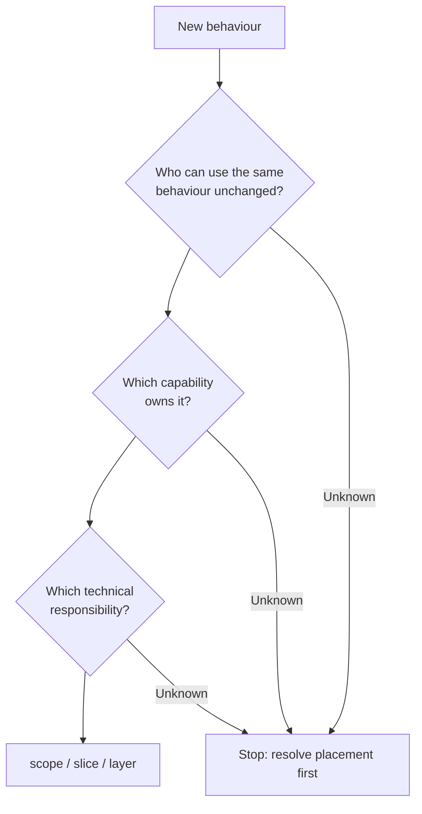
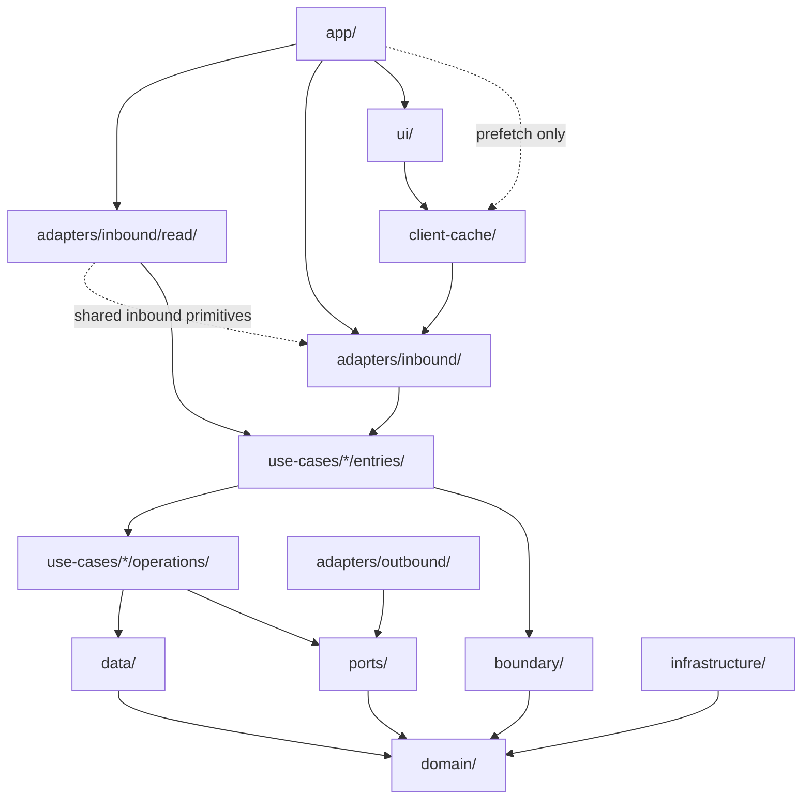
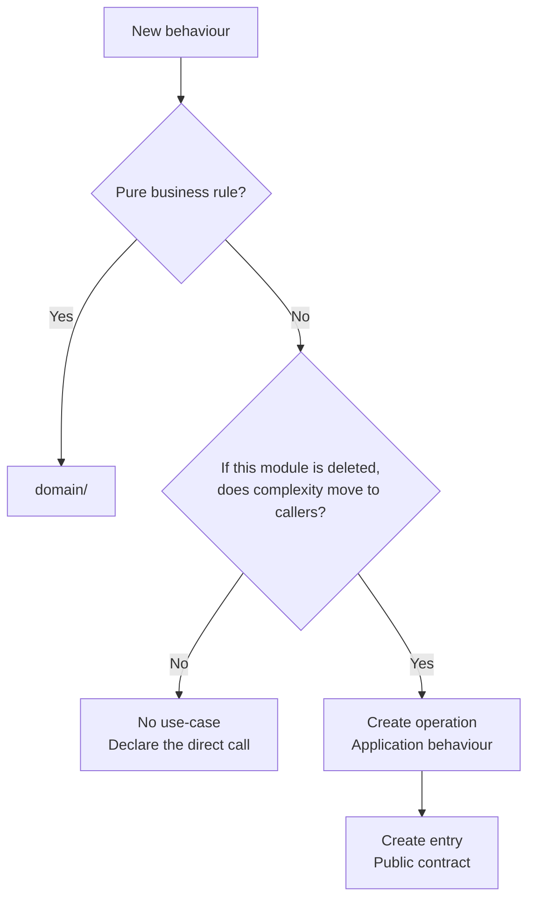

# Architecture Contract

This is the human-readable architecture behind `nextjs-architecture` and
`react-component-creator`. It defines placement, ownership, dependency direction, and public
application surfaces. Skill references contain implementation procedures and code-level checks.

The default profile is Next.js App Router with TypeScript. Existing projects keep equivalent tools
and names unless a migration is explicitly requested.

## Quality Goals

The structure exists to protect six outcomes:

| Goal | Architectural response |
| --- | --- |
| maintainability | prefer framework primitives and explicit ownership over custom indirection |
| modularity | separate scope, slice, and layer; publish narrow application surfaces |
| testability | keep domain pure and test data or providers at their real boundary |
| security | establish identity, role, tenant, and input trust at every server boundary |
| observability | classify and report an unexpected failure once with request context |
| evolvability | keep provider, framework, and browser lifecycle details outside application behaviour |

These are decision criteria, not claims that folders produce quality automatically. When two rules
conflict, record the trade-off and verify the runtime outcome that matters.

## Placement Model

Every non-trivial file has three coordinates:

| Coordinate | Question | Default |
| --- | --- | --- |
| **Scope** | Which actual consumers may use this implementation unchanged? | the narrowest current consumer set |
| **Slice** | Which business capability owns the behaviour? | a named capability such as `work-items` |
| **Layer** | Which technical responsibility does the file perform? | one layer from the generated table |


```mermaid
flowchart TB
  accTitle: Three coordinates used to place code
  accDescr: Placement starts with the narrowest valid reuse scope, then a business owner, then one technical responsibility.
  Change["New behaviour"] --> Scope{"Who can use the same<br/>behaviour unchanged?"}
  Scope --> Owner{"Which capability<br/>owns it?"}
  Owner --> Layer{"Which technical<br/>responsibility?"}
  Layer --> Placement["scope / slice / layer"]
  Scope -->|Unknown| Stop["Stop: resolve placement first"]
  Owner -->|Unknown| Stop
  Layer -->|Unknown| Stop
```

These coordinates are independent. A feature slice may cross several layers. The same layer may
contain many slices. Scope controls reuse; it does not override either ownership or dependency
direction.

## Scope And Reuse

Use the narrowest scope where behaviour is already valid:

| Reuse scope | Contains | Promotion signal |
| --- | --- | --- |
| one route | presentation and framework glue consumed by one route | a second route needs the same behaviour |
| one capability | behaviour consumed only inside one capability | another capability needs a stable public operation |
| repository | behaviour or a technical primitive consumed across capabilities | another shipped product needs the same contract |
| package or workspace | behaviour proven identical across products | independent consumers and release ownership exist |

Scope names consumers; slice names the business owner. A repository-wide operation can still belong
to one slice. The repository is the default product boundary, not the default reuse breadth.

Do not introduce product or business-line tiers merely because a larger system might need them
later. A multi-product workspace may define its own specificity lattice, but it must document
allowed dependency directions and enforce them separately from the portable layer rules.

Moving code outward creates a compatibility contract. Duplication is sometimes cheaper than a false
shared abstraction; promote only after the consumers and common meaning are visible.

## Compile-Time Dependencies

Arrows below mean representative imports, not runtime calls. The generated table is complete.


```mermaid
flowchart TB
  accTitle: Main compile-time dependency direction
  accDescr: Framework and browser layers call inward through inbound entries, declarations, operations, data or ports, and domain.
  App["app/"] --> Read["adapters/inbound/read/"]
  App --> Inbound["adapters/inbound/"]
  App --> UI["ui/"]
  App -. "prefetch only" .-> ClientCache["client-cache/"]
  UI --> ClientCache
  ClientCache --> Inbound
  Read -. "shared inbound primitives" .-> Inbound
  Read --> Entry["use-cases/*/entries/"]
  Inbound --> Entry
  Entry --> Operation["use-cases/*/operations/"]
  Entry --> Boundary["boundary/"]
  Operation --> Data["data/"]
  Operation --> Ports["ports/"]
  Outbound["adapters/outbound/"] --> Ports
  Data --> Domain["domain/"]
  Ports --> Domain
  Boundary --> Domain
  Infrastructure["infrastructure/"] --> Domain
```

<!-- contract:layer-table -->
| Layer | Owns | Same layer | May import across layers |
| --- | --- | --- | --- |
| `domain/**` | pure rules and domain types | yes | none |
| `use-cases/*/operations/**` | application orchestration and projections | yes | domain, ports, data |
| `use-cases/*/entries/**` | public validation, failure normalization, and reporting | no | domain, boundary, use-case-operations |
| `data/**` | local store access when no port exists | yes | domain |
| `adapters/outbound/**` | application port implementations | yes | domain, ports |
| `adapters/inbound/**` | request authorization and command or event composition | yes | domain, ports, data, outbound, infrastructure, boundary, use-case-entries |
| `adapters/inbound/read/**` | authenticated server-only reads | yes | domain, ports, data, outbound, infrastructure, inbound, boundary, use-case-entries |
| `client-cache/**` | browser cache and invalidation | yes | domain, inbound |
| `ui/**` | presentation and client interaction | yes | domain, client-cache |
| `app/**` | routing, rendering, and metadata | yes | domain, read, inbound, ui, client-cache (prefetch only) |
| `infrastructure/**` | environment, auth, logging, and cache plumbing | yes | domain |
| `ports/**` | application capability contracts | no | domain |
| `boundary/**` | shared declaration policy | no | domain |
<!-- /contract:layer-table -->

The names in `May import across layers` are keys from `rules/import-table.json`. “Same layer” means
the same classified row; nested `read` remains a separate layer from its `inbound` parent. The edge
between those two runs one way: `read/**` may reuse inbound primitives — request context, session,
authorization — while `inbound/**` may not import `read/**`. The read layer is composed for the
render path, so an HTTP caller that needs the same data reaches an entry, or a data module where no
scenario exists, instead of borrowing the render composition. Both paths may reuse the same entry,
operation, or data module. What stays separate is channel wiring: each caller establishes its
request boundary and translates the result for rendering or HTTP. The table is generated into this
document, the critical agent reference, and the always-loaded skill contract. Change the table, run
the fixer, and review all generated surfaces in the same pull request.

Same-layer imports are explicit, not implied: read the `Same layer` column rather than assume it
follows from the layer's nature. The reasons behind that column differ, and only one of them is
about contracts. An operation may compose operations because composition is the behaviour it owns.
A declaration may not call a declaration, because the inner one would normalize and report the
same failure under its own name. `ports/**` holds contracts with nothing to factor out, so a split
definition shares domain types instead of importing a sibling. `boundary/**` is closed for a
different reason again: the combinator is one policy applied to every entry, and a sibling import
is how a second policy begins. If that policy outgrows a single module, treat it as a reason to
revisit this row rather than to route around it.

Runtime flow may descend through code a module never imports. An inbound adapter constructs an
outbound implementation and supplies it to an operation through a port-shaped dependency. The
operation calls the dependency at runtime without importing its concrete adapter.

## Slices And Public Surfaces

A slice is a business capability such as `work-items`, `campaigns`, or `chat`. Use one capability
name consistently across its layers:

```text
domain/work-item
use-cases/work-items
data/work-items
adapters/inbound/.../work-items
client-cache/work-items
app/.../work-items
```

Rules:

- a slice owns behaviour, not a page, database table, or transport;
- shared meaning moves into `domain/**`;
- cross-slice application composition uses published `operations/**`;
- entries wrap their own slice's operation;
- route-private presentation stays with the route until another consumer appears;
- a generic helper does not become a slice merely because its owner is unclear.

Portable lint enforces layer boundaries but cannot compare source and target slice names. Projects
that require hard slice isolation add project-specific zones plus an inventory check for newly added
slices. See [Adoption And Enforcement](./adoption-and-enforcement.md).

## When A Use-Case Exists

A use-case exists only when deleting it would move meaningful complexity into its callers.

The deletion test may pass because the module owns:

- orchestration across multiple effects or capabilities;
- an application rule not owned by the store;
- a projection combining multiple sources;
- application behaviour shared by multiple inbound boundaries.

A storage call with a new name is not a use-case. If no scenario exists, the inbound or read
entrypoint declares the contract directly around the data or port call.


```mermaid
flowchart TB
  accTitle: Decide whether behaviour needs a use-case
  accDescr: Pure rules go to domain, shallow effects stay direct, and behaviour that survives the deletion test becomes an operation with an entry.
  Change["New behaviour"] --> Pure{"Pure business rule?"}
  Pure -->|Yes| Domain["domain/"]
  Pure -->|No| Delete{"If this module is deleted,<br/>does complexity move to callers?"}
  Delete -->|No| Direct["No use-case<br/>Declare the direct call"]
  Delete -->|Yes| Operation["Create operation<br/>Application behaviour"]
  Operation --> Entry["Create entry<br/>Public contract"]
```

Line count is never the criterion. A short operation can own a real rule; a long forwarding module
can still own nothing.

## When A Port Exists

A port is an application-owned capability contract, not a repository interface created for every
stored entity.

This contract reserves **port** for a capability used by the application from the outside. Public
inbound application surfaces are **entries**. This removes the primary-port/secondary-port
ambiguity without changing the Ports and Adapters dependency direction.

Declare a port when all of these hold:

1. The core needs the capability independently of a specific technology or provider.
2. The contract is written in application language, not CRUD or SDK language.
3. A real consumer and production implementation exist now.

| Dependency | Default |
| --- | --- |
| pure in-process computation | ordinary module |
| store runnable from checked-in migrations | `data/**`, tested against the real engine |
| owned remote service | port plus outbound adapter |
| third-party service | port plus outbound adapter |

Adapter count is evidence, not a gate. A test adapter is useful only when it preserves the contract;
integration tests against the real engine or provider boundary still remain.

## Entry And Operation

An **operation** contains typed application behaviour. It may throw typed application failures and
never reports them.

An **entry** declares one operation through the shared boundary combinator. The declaration:

1. validates input and output;
2. normalizes failures into the public result;
3. reports an unexpected failure once;
4. removes sensitive fields before telemetry.

Framework control flow stays outside the declaration. `redirect()`, `permanentRedirect()`, and
`notFound()` are called by the framework entrypoint after it receives the result.

Declarations never call declarations. Composition uses operations and receives one outer
declaration.

## Reference Slice

This tree shows ownership, not a mandatory file per box:

```text
src/
├── domain/work-item/
├── use-cases/work-items/
│   ├── operations/
│   │   └── update-status.ts
│   └── entries/
│       └── update-status.ts
├── data/work-items/
├── ports/notifications/
├── adapters/
│   ├── inbound/next/work-items/
│   ├── inbound/read/work-items/
│   └── outbound/notifications/
├── client-cache/work-items/
├── ui/work-items/
├── app/work-items/
├── boundary/
└── infrastructure/
```

For a command, the inbound adapter authorizes, builds request context and dependencies, then calls
the entry. The entry declares the contract and delegates behaviour to the operation. The operation
uses `data/**` or a supplied port. A read follows the same ownership rules without forcing a
use-case when no scenario exists.

## Non-Goals

This architecture does not require:

- a DI container;
- a port per table;
- a use-case per endpoint;
- TanStack Query for every read;
- a product-specific scope hierarchy;
- a file for every layer in every slice.

Those choices must be justified by current application behaviour, not by a folder template.

Continue with [Runtime Boundaries](./runtime-boundaries.md) for security, failures, cache ownership,
transactions, observability, and testing. Use [Frontend Composition](./frontend-composition.md) for
RSC, Client Components, forms, and UI state.
