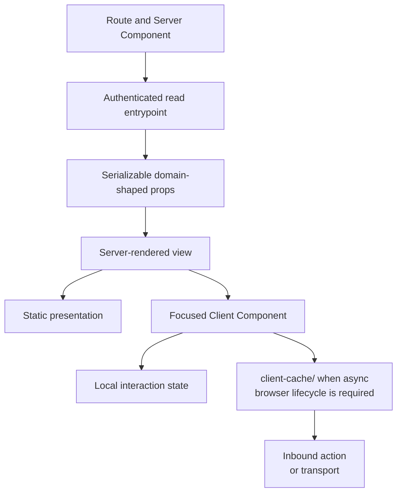
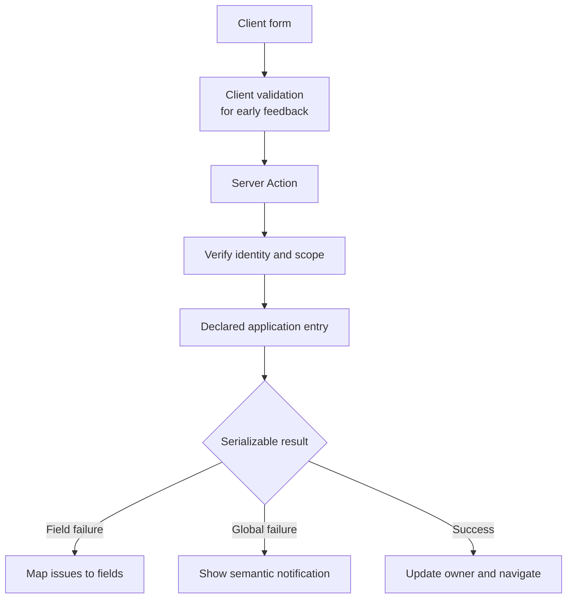

# Frontend Composition

This document defines the human-facing UI architecture. It complements the application layers in
[Architecture Contract](./architecture-contract.md); it does not create a second data-access path.

## Server And Client Boundary

Server Components are the default. Add a Client Component only where browser state, effects,
subscriptions, event handlers, or a client-side cache require one.

| Concern | Owner |
| --- | --- |
| initial data and authorization | Server Component through a read entrypoint |
| routing, metadata, layout, and streaming boundary | `app/**` |
| rendering from plain props | `ui/**` view |
| browser interaction | focused Client Component |
| browser-managed async lifecycle | `client-cache/**` |
| server mutation | Server Action through a declared application entry |



Do not mark a component `use client` to make an import error disappear. Move server work back to an
authenticated server entrypoint and pass the smallest serializable value the client needs.

## Page Composition

A route owns framework decisions; a view owns presentation:

- the route reads `params`, `searchParams`, cookies, headers, and metadata APIs;
- a read entrypoint authorizes and returns domain-shaped data;
- the view receives plain props and does not know how they were loaded;
- independent sections may stream through separate `Suspense` boundaries;
- business branching belongs in an operation, not in a loader or view;
- framework navigation happens after the application result is known.

Parallel reads remain parallel when they are independent. When their results must be combined by an
application rule, that combination is an operation and receives one declared entry.

## State Placement

Place state by lifetime and authority:

| State kind | Placement |
| --- | --- |
| server read used for the initial render | RSC props |
| realtime, polling, optimistic, or infinite data | `client-cache/**` |
| shareable navigation state | URL |
| form input, dirty state, and field errors | form boundary |
| local disclosure or selection state | owning component |
| state shared by one compound component | split state/actions providers |
| authenticated identity and tenant | server request context |
| derived value | compute during render or in a pure helper |

Context is for a real shared browser lifetime, not for making props disappear. A generic UI store
does not own server data.

## Forms And Actions

The form owns interaction and feedback. The Server Action is an inbound adapter, not the
application behaviour.



Rules:

- server validation remains authoritative;
- the application schema is declared once;
- a pending state comes from the action lifecycle, not a second boolean;
- expected validation or conflict results remain data;
- successful writes invalidate the owner of affected reads;
- destructive actions use one shared confirmation surface;
- a notification helper accepts semantic intent, not provider text.

Use the project's existing form, schema, component, and notification libraries unless migration is
explicitly requested.

## Component Structure

Keep rendering and interaction logic separable:

```text
Feature/
├── Feature.tsx          public composition
├── FeatureView.tsx      rendering from props
├── use-feature-props.ts client interaction and derived props, when needed
├── actions.ts           colocated Server Actions, when needed
└── feature.module.css   local styles, when used by the project
```

This is a responsibility map, not a required five-file scaffold. Keep a component in one file while
the responsibilities remain readable.

For logic-heavy Client Components, `composeHooks(View)(useProps)` keeps the view testable and the hook
focused on browser behaviour. Do not introduce the pattern for a component with no meaningful
interaction logic.

For compound components, split state and actions providers when consumers frequently need only one.
This reduces unrelated rerenders and makes the public API explicit.

## Component Scope

Use the narrowest owner:

| Used by | Placement |
| --- | --- |
| one route | that route's private UI |
| one capability across routes | the slice's `ui/**` surface |
| several capabilities in one product | repository UI primitives |
| independently shipped products | versioned design-system package |

Visual similarity is not shared meaning. Promote a component only when its behaviour and change
ownership are shared.

## Styling, Content, And Accessibility

- Reuse the target project's component library, tokens, and styling approach.
- Do not replace Zod with Valibot, Tailwind with Mantine, or another established stack implicitly.
- Keep user-facing text in the project's i18n system.
- Preserve labels, descriptions, error associations, focus order, and keyboard behaviour.
- Use explicit variants rather than a boolean or string mode that creates unrelated component states.
- Keep loading, empty, error, disabled, optimistic, and success states in the owning surface.
- Respect reduced motion and avoid animation that hides state changes.

## UI Verification

Verify the rendered workflow, not only component snapshots:

1. server and client boundaries compile without importing server-only code into the browser;
2. loading, empty, success, expected failure, and unexpected failure states render;
3. forms retain field values and associate errors with controls;
4. successful writes update or invalidate the single state owner;
5. keyboard navigation, focus restoration, and responsive layout work;
6. no duplicate notification or exception report appears.

Detailed procedures:

- [Server/Client Boundary](../plugins/nextjs-clean-skills/skills/react-component-creator/references/server-client-boundary.md)
- [State Placement](../plugins/nextjs-clean-skills/skills/react-component-creator/references/state-placement.md)
- [Forms And Actions](../plugins/nextjs-clean-skills/skills/react-component-creator/references/forms-and-actions.md)
- [Component Structure And composeHooks](../plugins/nextjs-clean-skills/skills/react-component-creator/references/component-structure-composehooks.md)
- [Notifications And Feedback](../plugins/nextjs-clean-skills/skills/react-component-creator/references/notifications-and-feedback.md)
- [Styling And i18n](../plugins/nextjs-clean-skills/skills/react-component-creator/references/styling-and-i18n.md)
