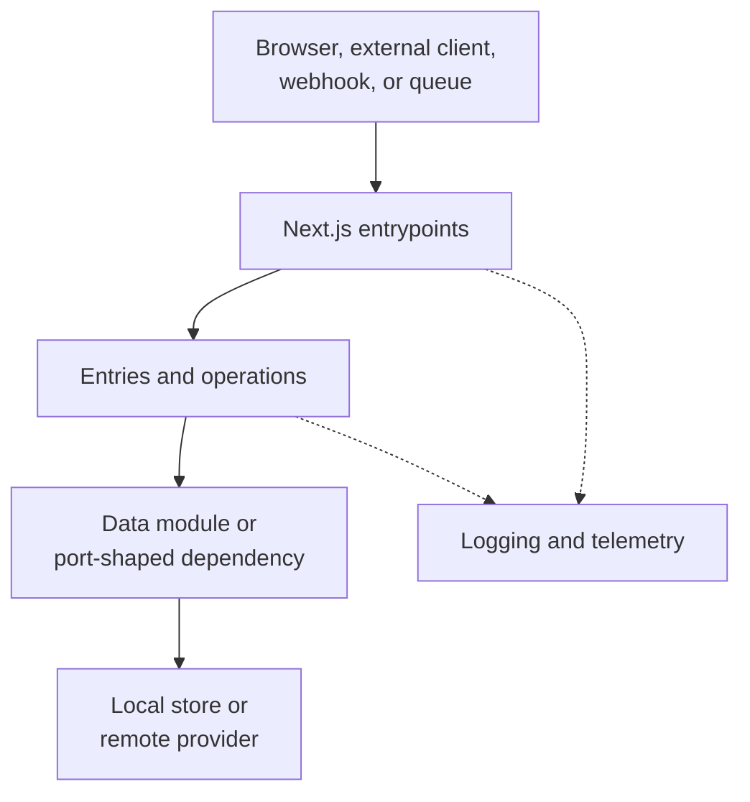
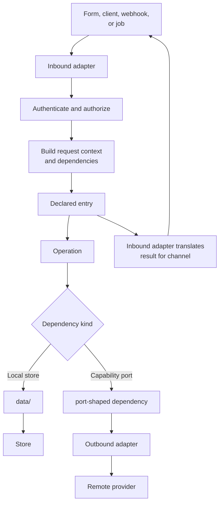
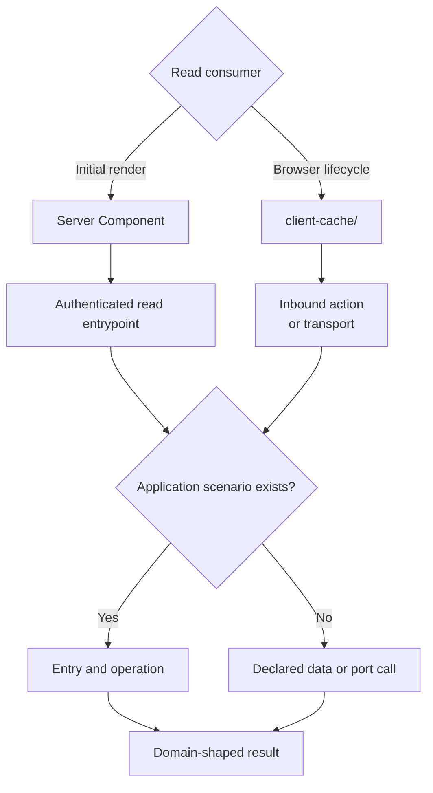
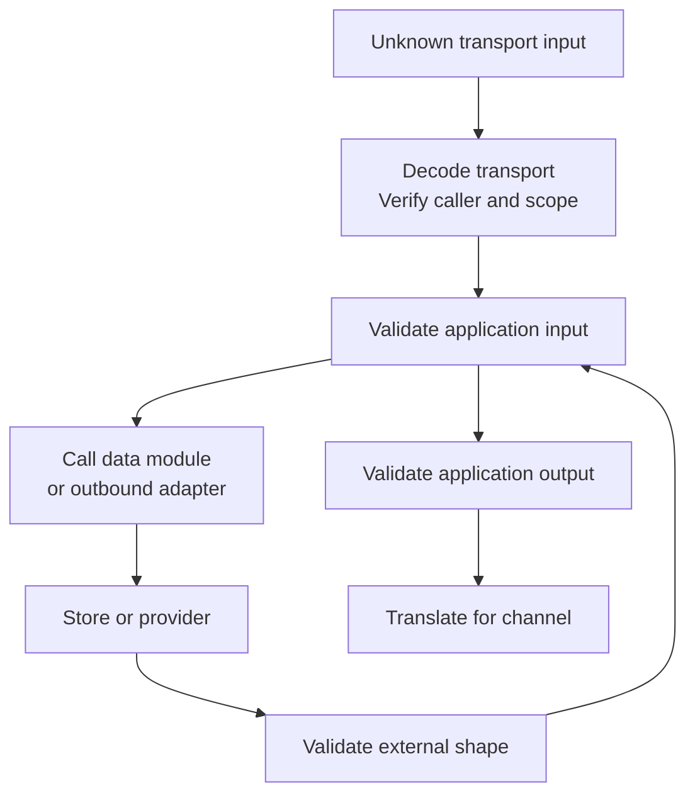
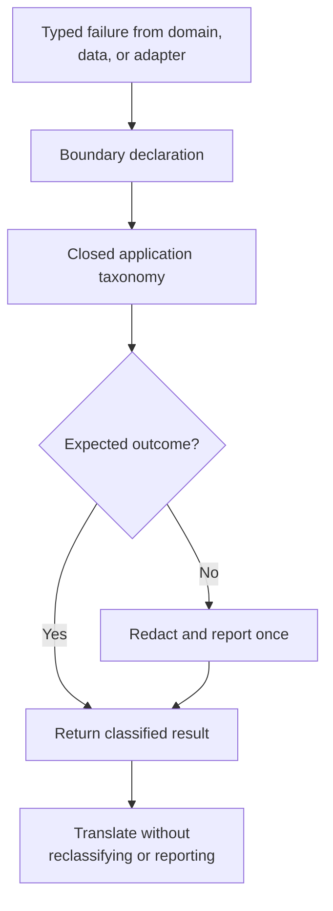
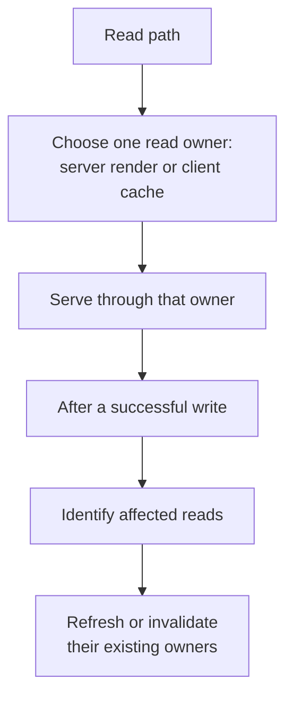

# Runtime Boundaries

This document describes how work enters the application, where trust is established, who owns
failures and state, and which layer holds authority. Compile-time permissions remain defined by
[Architecture Contract](./architecture-contract.md).

## System Context

The Next.js process contains framework adapters, application behaviour, and concrete integrations.
Browsers and external callers never reach data or providers without crossing a server boundary.

## Composition Root

The framework entrypoint and its inbound adapter form the composition root. Together they:

1. decode the channel-specific payload;
2. verify identity, role, and tenant;
3. create request context;
4. construct outbound implementations;
5. call the declared application entry;
6. translate its result into the channel's response.

Dependencies are supplied explicitly. A container is optional; introduce one only when repeated
assembly or lifecycle management is demonstrably harder than explicit factories.

## Choose The Framework Boundary

| Need | Boundary |
| --- | --- |
| read-heavy initial render | Server Component through a server-only read entrypoint |
| realtime, polling, optimistic, infinite, or shared browser lifecycle | `client-cache/**` |
| command from this UI | Server Action |
| external client or service API | Route Handler |
| webhook | Route Handler with raw-body verification and idempotency |
| SSE or another long-lived response | Route Handler with resume and cancellation |
| long-running durable work | queue or workflow |

A Server Component does not call its own Route Handler over HTTP. Both call the same application
surface in process.

## Command Flow

Only the entry normalizes and reports application failures. The inbound adapter translates the
already-classified result; it does not classify or report the same failure again.

## Read Flow

Reads do not earn use-cases merely because they perform I/O. The deletion test still decides.

## Trust And Validation

Each boundary validates the concern it owns:

| Boundary | Establishes | Must not do |
| --- | --- | --- |
| inbound adapter | caller identity, authorization, and transport decoding | duplicate the application schema |
| boundary declaration | application input and output contract | depend on framework control flow |
| data module or outbound adapter | provider and storage shapes | leak rows, SDK errors, or provider messages |
| client | early feedback only | act as authority |

Every protected server read and write re-verifies identity, role, and tenant. `proxy.ts` may refresh
or redirect; it is not the authorization boundary. Store policies are defence in depth, not the only
authorization check.

## Failure Ownership

One failure receives one application classification and one unexpected-error report.

Provider codes are translated where they are understood. HTTP statuses and form states are
transport mappings, not failure kinds. Raw provider messages never cross the adapter.

| Channel | Translation |
| --- | --- |
| Server Action | serializable action state |
| Route Handler | HTTP status and response envelope |
| Server render | rendered failure or framework-owned error surface |
| stream | in-stream failure event |

Framework navigation remains outside the declaration because `redirect()`, `permanentRedirect()`,
and `notFound()` use framework-controlled exceptions. The declaration returns a value; the
framework entrypoint navigates.

## State And Cache Ownership

Every value has one authority, and every read path has one owner:

| State | Owner |
| --- | --- |
| initial read-heavy page data | server render, passed as plain values |
| realtime, polling, infinite, optimistic, or shared async browser data | client cache |
| shareable filters, tabs, and paging | URL |
| form state | the form boundary |
| local presentation state | owning component |
| server session and authorization context | server request context |
| derived value | no store; compute it |

A client cache may be seeded from a server value with an explicit freshness decision. Copying server
data into component state creates a second owner and is not seeding.

## Authority And Transactions

- A stored function owns the transaction it implements.
- The application decides whether to call it; it does not reproduce the transaction as ordered
  client calls.
- Bulk operations are scoped by caller identity and tenant at the authoritative boundary.
- Idempotency belongs where retries can enter.
- Row types stay in data or adapters; domain types do not mirror storage names.

## Observability

- Initialize instrumentation before application modules.
- Carry a request or trace id through inbound context, operations, and adapters.
- Log structured application classifications, not raw payloads.
- Capture an unexpected failure once at the declaration.
- Redact declared sensitive fields before logs or telemetry.
- Mark re-raised render errors as already reported so framework hooks do not duplicate them.

## Testing Contract

| Surface | Test against |
| --- | --- |
| domain rules | pure inputs and outputs |
| declared entries | public success and failure results |
| `data/**` | real local engine and migrations |
| outbound adapters | fake server or provider boundary |
| inbound adapters | stubbed entries plus real decoding and authorization logic |
| client cache | stubbed inbound adapter and observable invalidation |
| UI | rendered behaviour at the network boundary |
| end to end | real route, auth, data, and browser |

Tests cross the same public seam as callers. Test doubles replace remote capabilities, not a local
engine whose query, policy, or transaction is the behaviour under test.

Detailed procedures:

- [Failure At The Application Boundary](../plugins/nextjs-clean-skills/skills/nextjs-architecture/references/errors/failure-at-the-boundary.md)
- [Validate Once Per Trust Boundary](../plugins/nextjs-clean-skills/skills/nextjs-architecture/references/use-cases/validation-once.md)
- [Cache Tiers And Read Ownership](../plugins/nextjs-clean-skills/skills/nextjs-architecture/references/caching/cache-tiers.md)
- [Security, DAL, And Auth](../plugins/nextjs-clean-skills/skills/nextjs-architecture/references/security/dal-and-auth.md)
- [Authority And Transactions](../plugins/nextjs-clean-skills/skills/nextjs-architecture/references/outbound/authority-and-transactions.md)
- [Testing By Layer](../plugins/nextjs-clean-skills/skills/nextjs-architecture/references/quality/testing-by-layer.md)
