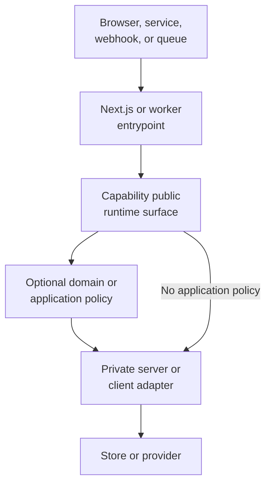
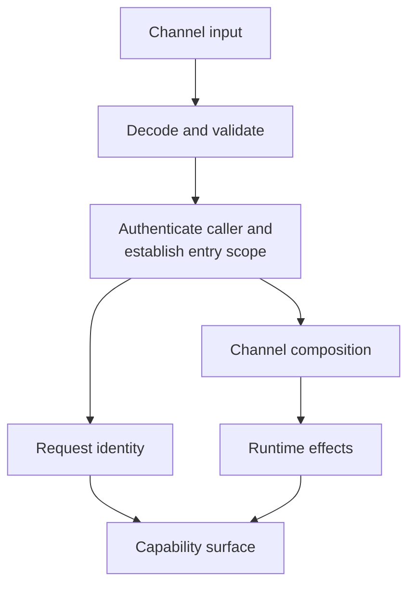
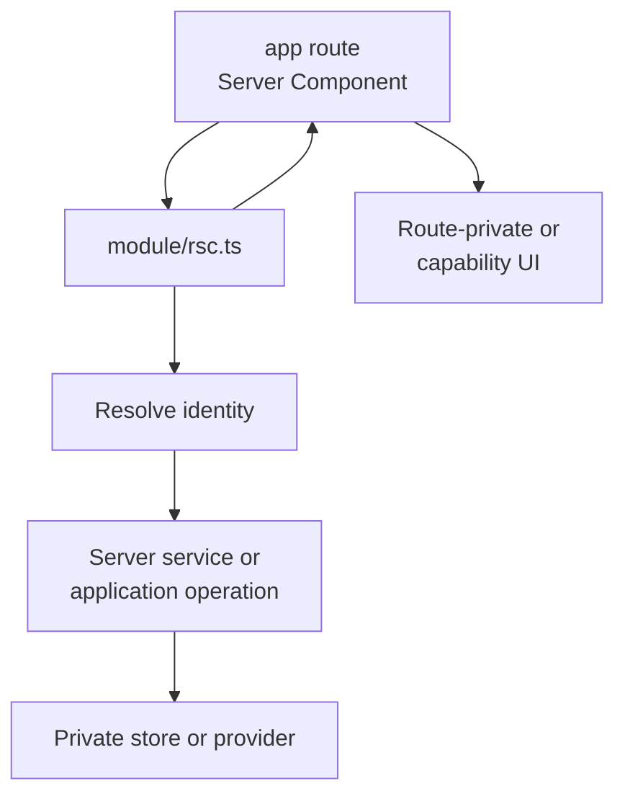
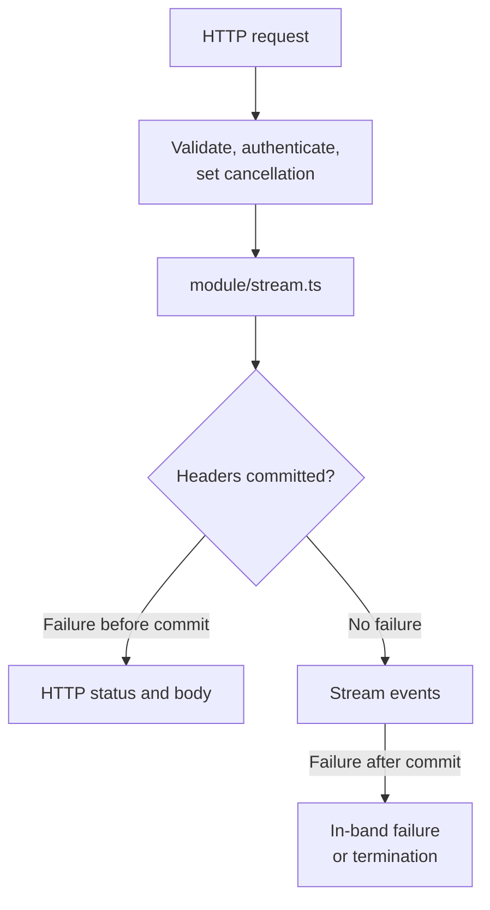

# Runtime Boundaries

This document defines how work enters a capability, where trust is established, who owns failures,
and which runtime surface is public. Placement and compile-time ownership remain defined by
[Architecture Contract](./architecture-contract.md).

## System Context

Browsers and external callers enter through Next.js framework boundaries. Framework adapters call
capability surfaces; they do not bypass modules to reach stores or providers.



## Choose The Channel

| Need | Framework boundary | Capability surface |
| --- | --- | --- |
| initial or server-rendered read | Server Component | `rsc.ts` or trusted `server.ts` |
| UI command | Server Action | `actions.ts` |
| browser-owned read lifecycle | `GET` Route Handler | `client.ts` consumes the HTTP contract |
| external API or webhook | Route Handler | trusted `server.ts` |
| SSE or long-lived HTTP response | Route Handler | `stream.ts` |
| durable background work | queue or workflow | `job.ts` |

Server Components call server code directly. They do not fetch their own Route Handler over HTTP.
Server Actions are queued mutation boundaries; using them for reads introduces sequential browser
data fetching. Browser-owned reads therefore use `GET` or a stream.

Create only channels the product uses. A capability with one RSC read needs no action, HTTP, stream,
job, or client surface.

Call `server.ts` directly from a Server Component only when that route itself performs the RSC
channel duties: establish identity, translate the render outcome, and own unexpected-error
reporting. Otherwise keep those duties in `rsc.ts`.

## Request Context And Effects

Request identity contains:

- actor identity and roles;
- tenant or ownership scope;
- request and trace identifiers.

Database clients, provider clients, reporter, clock, and other effects are dependencies, not
identity. Keep them separate even when one runtime factory resolves both.



Authentication and entry-level permission happen at every protected server entry. Business
authorization belongs to domain or application policy. Tenant and ownership predicates remain
enforced at the store or RLS boundary. Proxy, middleware, layouts, and hidden UI are not sufficient
authorization boundaries.

`server.ts` is a trusted in-process composition surface, not an outer runtime channel. It accepts
identity and scope established by an outer channel, enforces the source capability's policy,
translates provider failures, and propagates unexpected exceptions without reporting them. The RSC,
action, HTTP, stream, or job that owns the request reports once.

An effect factory may bind identity when the provider does. A cookie-scoped database client and its
verified actor are created atomically from one session, then exposed as separate context fields. A
privileged client uses a different server-only factory and an explicit trusted scope; it is never
substituted into the user-scoped context.

## RSC Reads

`rsc.ts` is a current-request surface. It may resolve request identity, wire private server
dependencies, invoke the capability, and translate expected outcomes for rendering.



Keep framework navigation outside generic catches. `redirect`, `permanentRedirect`, and `notFound`
use framework control flow and must not be normalized as application failures.

## Server Actions

`actions.ts` is a dedicated module with top-level `'use server'`. It is used for UI commands, not
browser reads. Next.js requires every value export from that module to be an async function declared
there; import and call a private implementation instead of value-re-exporting it.
[Next.js reference](https://nextjs.org/docs/app/api-reference/directives/use-server).

The action:

1. parses serializable input or `FormData`;
2. re-authenticates and establishes entry-level permission;
3. invokes business authorization and behavior through the capability;
4. maps expected outcomes to serializable action state;
5. reports an unexpected failure once;
6. invalidates the read owner after a successful write.

A Server Action is a public HTTP entrypoint even when only one component imports it. Never trust
actor, role, tenant, price, or ownership values supplied by the client.

## HTTP And Browser Reads

Route Handlers live under `app/**` because they are framework files. They decode HTTP and call a
capability public surface; durable product policy remains inside the capability.

They never import a capability's private `server/**`, `application/**`, or `domain/**` files.
Endpoint-only schemas stay with the route; reusable contracts are deliberately published through a
narrow root surface. Failure classifiers required by the handler are part of that root contract,
not imports from private `application/**`.

`GET` owns browser-readable query parameters, status, headers, cache policy, and public response
shape. `client.ts` owns the browser-side fetch or subscription contract. Neither surface owns
business authorization or provider rows.

Do not create an HTTP round trip for an RSC merely to reuse a Route Handler. Reuse the capability
behavior that both channels call.

When Next.js fronts an authoritative external backend, the remote service owns business invariants
and orchestration. The local module may own HTTP mapping, presentation values, aggregation, cache,
browser lifecycle, and frontend/BFF-specific policy. Empty `domain/` or `application/` segments are
the correct result when no local behavior survives the deletion test.
[Next.js BFF guide](https://nextjs.org/docs/app/guides/backend-for-frontend).

## Streams

A stream has a temporal boundary: failures before response commit can change HTTP status; failures
after commit must travel in-band or terminate the stream.



The stream channel owns:

- response commit state;
- cancellation and disconnect propagation;
- sliding idle timeout;
- resume cursor or event ID when supported;
- in-band error representation after commit.

One channel-owned `AbortController` joins both cancellation sources. The incoming request signal and
the response stream's `cancel()` callback abort that controller; its signal is passed to the upstream
producer. A local boolean does not release the upstream resource.

When startup failures require an HTTP status, the upstream stream is acquired before the `Response`
is constructed or returned. A failure from asynchronous stream production after return is already a
body-channel failure even if no application event has been enqueued.

Do not retry an ordinary committed stream as if no bytes were sent. Reconnect/resume is a protocol
decision.

A reusable application operation may own provider-neutral generation and a capability deadline. It
must not accidentally make a background job inherit the stream's idle timeout. Share a named
provider-liveness policy only when both channels intentionally use the same semantics.

## Jobs

`job.ts` maps capability behavior to worker-native outcomes:

- completed;
- retry with a reason and policy;
- dropped or dead-lettered;
- cancelled.

The job owns deadline, retry, backoff, idempotency, and dead-letter decisions. It does not emulate
HTTP status, stream commit, or form state.

## Failures And Reporting

Channels share semantic primitives, not one universal wrapper:

```text
expected application outcome -> typed value
unexpected defect or outage  -> exception
framework control flow        -> framework boundary
```

| Channel | Expected outcome | Unexpected failure |
| --- | --- | --- |
| RSC | renderable value or state | report once, then throw |
| Server Action | serializable action state | report once, then throw |
| HTTP | status, headers, public body | report once, return generic 5xx |
| stream | pre-commit response or in-band event | report once at the owning stream boundary |
| job | retry/drop/dead-letter result | report once at the worker boundary |

Provider errors are mapped where the provider is understood. Public channels expose stable safe
codes, never raw provider messages. Inner operations and adapters do not report an error that the
outer channel will report.

## Validation

Validate once per trust transition:

| Transition | Validation owner |
| --- | --- |
| untrusted transport to typed input | framework/channel boundary |
| provider or database data to trusted code | private adapter |
| internal capability to external serialized contract | public channel surface |

Do not re-parse a typed internal value because it crossed a directory. Keep provider rows distinct
from domain/public values when naming or semantics differ.

For authorization-sensitive joins, distinguish visible, missing, and forbidden references using a
non-enumerating result. A combined workflow may reject the whole result; it must not silently omit a
forbidden reference when product policy requires rejection.

## Cache Ownership

Every read path has one owner:

| Read lifecycle | Owner |
| --- | --- |
| initial server render | RSC |
| realtime, polling, infinite, optimistic, or shared browser cache | capability `client/` |
| public HTTP caching | Route Handler and HTTP cache contract |
| shared server result | capability server cache |

Application operations may return ownership metadata, not call Next.js cache APIs. The runtime
surface maps a successful write to the current framework invalidation primitive. Cache keys include
the full user or tenant scope whenever authorization changes the result.

When RSC prefetch hydrates a browser-owned TanStack Query cache, both sides use one serializable
query-key identity from the capability's `query-cache.ts`. This neutral surface contains keys only:
Next.js cache tags and invalidation remain private server concerns.

## Authority And Transactions

- A stored function owns the transaction it implements.
- Application policy decides whether to invoke it; it does not reproduce the transaction as
  ordered client calls.
- Bulk operations are scoped by caller and tenant at the authoritative boundary.
- Idempotency belongs where retries enter.
- Provider rows remain private to their adapter.

## Testing Contract

| Surface | Test |
| --- | --- |
| domain | pure inputs, outputs, and invariants |
| application operation | policy outcomes with narrow dependency fakes |
| private local store | real engine and migrations |
| remote-provider adapter | provider contract or fake server |
| trusted `server.ts` surface | explicit identity, policy, mapping, and silent failure propagation |
| RSC, Route Handler, or action | channel decoding, native outcome, and report-once behavior |
| stream | pre/post-commit failure, cancellation, idle timeout, and resume |
| job | retry, deadline, idempotency, and dead-letter policy |
| end to end | real route, auth, data, browser, and production build |

Test through the same public surface as production callers. Replace remote capabilities with test
adapters; do not replace a local engine when its query, policy, or transaction is the behavior
under test.
