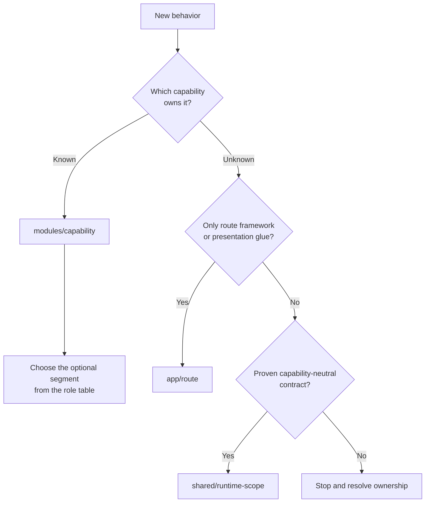
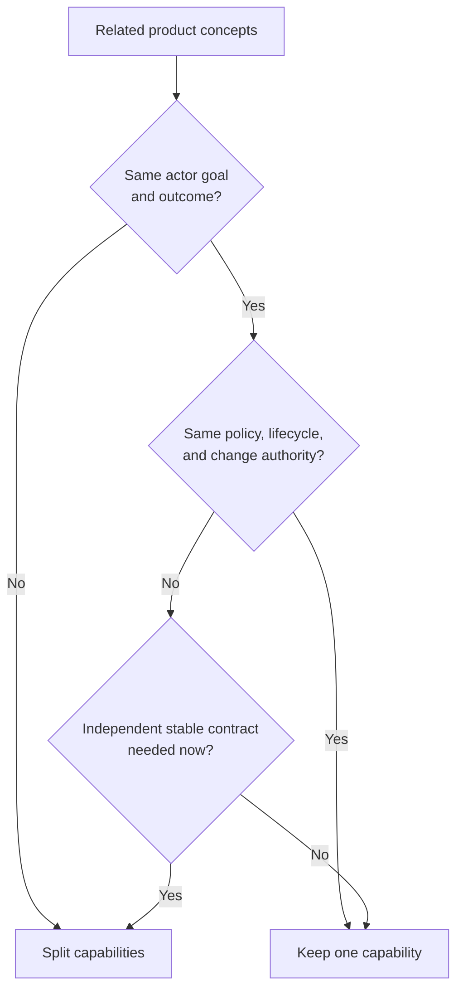
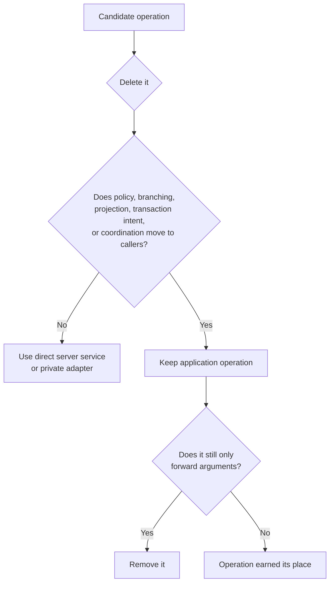
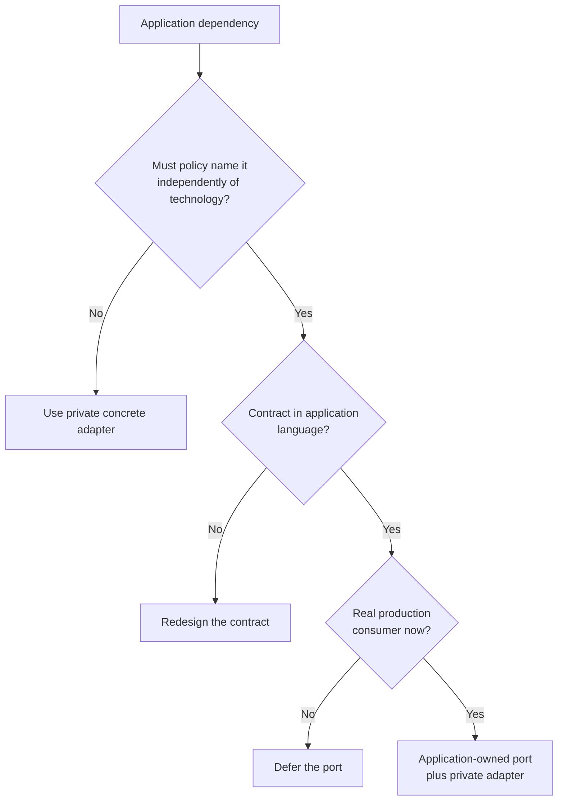
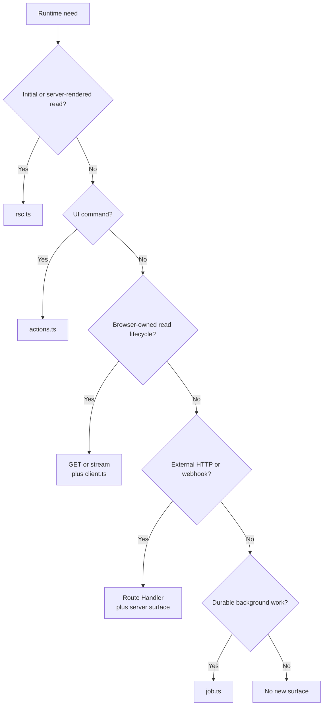
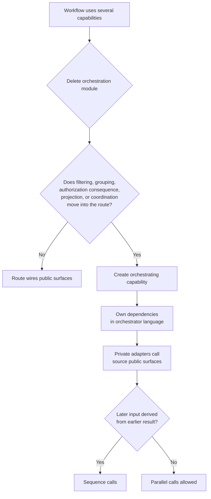
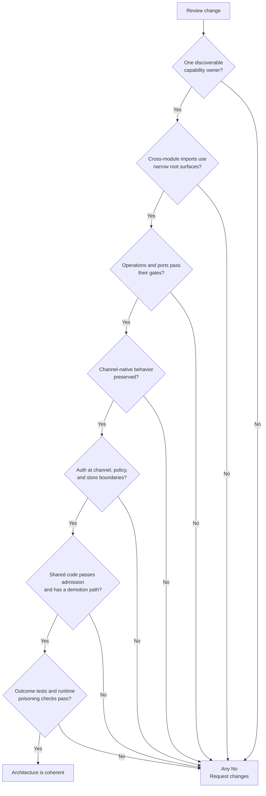

<!-- Generated by scripts/sync-plugin-contract.mjs from the repository root. Do not edit here. -->

# Architecture Decision Maps

These maps summarize [Architecture Contract](./architecture-contract.md). They do not define a
second contract.

## Place New Code

| Role | Segment |
| --- | --- |
| pure invariant or calculation | `domain/` |
| product policy or orchestration | `application/` |
| private server I/O or composition | `server/` |
| browser-owned async lifecycle | `client/` |
| reusable capability presentation | `ui/` |

Do not create an empty segment. Route-private UI stays under `app/**`; product policy does not.

## Decide Capability Granularity

Tables, CRUD screens, routes, providers, repeated role checks, and file counts are not module
boundaries by themselves.

## Decide Whether An Operation Exists

Line count is not the criterion. Validation, row mapping, cache invalidation, or telemetry alone do
not create application behavior.

## Decide Whether A Port Exists

A test mock or possible second provider is not a gate. A remote provider can warrant a port with one
implementation; a local store can remain direct.

## Choose The Runtime Surface

Server Components call server code directly. Browser reads do not use Server Actions.

## Decide Cross-Capability Ownership

Source capabilities never import one another or the orchestrator.

## Review A Change

Do not copy these maps into `AGENTS.md`, `CLAUDE.md`, or a system prompt. Link the canonical
document instead.
