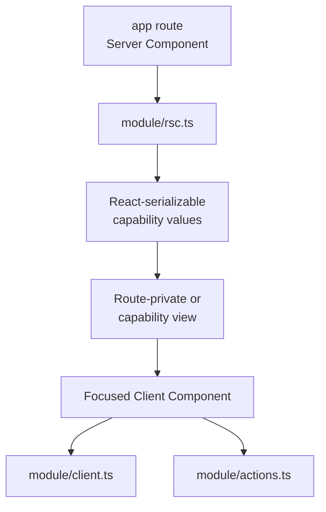
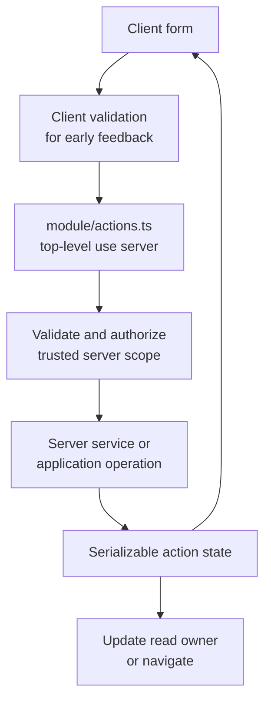

# Frontend Composition

This document defines UI ownership inside the capability architecture. It does not create a second
data path around [Runtime Boundaries](./runtime-boundaries.md).

## Server First

Server Components are the default. Add a Client Component only for browser state, effects,
subscriptions, event handlers, or browser-owned async lifecycle.

| Concern | Owner |
| --- | --- |
| route, metadata, params, and server rendering | `app/**` |
| current-request data and authorization | capability `rsc.ts` |
| route-private presentation | `app/<route>/_components/**` |
| reusable capability presentation | `modules/<capability>/ui/**` through `ui.ts` |
| browser async lifecycle | `modules/<capability>/client/**` through `client.ts` |
| UI mutation | capability `actions.ts` |
| cross-capability UI primitive | admitted `shared/ui` |



Do not add `'use client'` to hide an import error. Move server work to a server surface and pass the
smallest React-serializable value the client needs.

## Page Composition

The route owns framework decisions:

- `params`, `searchParams`, cookies, headers, metadata, and navigation;
- Suspense and route error boundaries;
- composition of capability public surfaces;
- route-private visual layout.

The capability owns product behavior:

- authorization consequences;
- filtering, grouping, projection, and orchestration;
- stable values returned to the route;
- browser lifecycle for capability data.

Independent reads may run in parallel. A read that needs IDs or scope from another result is
sequential. Cross-capability policy does not belong in a page loader merely because the page is its
first consumer.

## State Placement

| State | Placement |
| --- | --- |
| initial server-rendered data | RSC values |
| realtime, polling, optimistic, infinite, or shared browser cache | capability `client/` |
| shareable filters, tabs, and paging | URL |
| form input, dirty state, and field errors | form boundary |
| local disclosure or selection | owning component |
| one compound component's shared state | focused provider |
| identity and tenant scope | server request context |
| derived value | compute; do not store |

Context is for a real shared browser lifetime, not for making props disappear. Copying server values
into local state creates a second owner unless it is an explicit editable draft.

## Forms And Actions

A form owns interaction and feedback. A Server Action is a public mutation boundary, not the
application behavior.



Rules:

- server validation remains authoritative;
- the action derives applicable actor and tenant from trusted server state, then authorizes the
  command;
- expected validation or conflict outcomes remain serializable data;
- unexpected failures are reported once at the action boundary;
- successful writes update or invalidate affected read owners;
- a pending state comes from the action lifecycle, not a duplicate boolean;
- destructive actions use the product's shared confirmation surface;
- notifications use semantic intent, never provider text.

Client Components may import a Server Action only from a dedicated module with top-level
`'use server'`. Inline directives belong to Server Components and are not a substitute for an
importable action module.

## Component Structure

Call Hooks directly from named components or named custom Hooks. Do not pass Hooks as values or hide
them inside a generic higher-order helper.

```tsx
'use client'

export function WorkItems(props: WorkItemsProps) {
  const viewProps = useWorkItemsProps(props)
  return <WorkItemsView {...viewProps} />
}

export function WorkItemsView(props: WorkItemsViewProps) {
  return <section>{/* render from props */}</section>
}
```

This preserves local reasoning and lets `eslint-plugin-react-hooks` see the call site. React's
official rule is explicit: Hooks are called inside components or Hooks and are not passed as regular
values. A generic `withHooks(View)(useProps)` factory fails that rule and the deletion test.

The split is optional:

- keep controller and view in one file while responsibilities remain readable;
- use a separate view file when it is tested independently or should remain server-renderable
  without inheriting a file-level `'use client'`;
- extract a custom Hook only when browser behavior has a coherent reusable or testable contract;
- add `memo` only for a measured rerender problem.

A Hook-free view is a convention established by review and tests, not a guarantee created by its
filename.

## Component Ownership

| Used by | Placement |
| --- | --- |
| one route | `app/<route>/_components` |
| one capability across routes | `modules/<capability>/ui` and `ui.ts` |
| several capabilities with identical product meaning | admitted `shared/ui` |
| independently shipped products | versioned design-system package |

Visual similarity is not shared meaning. Promote UI only when behavior, semantics, and change
ownership are shared. Demote it when one capability begins driving most changes.

## Client Data

Use a capability client surface only when the browser owns the lifecycle:

- realtime or subscriptions;
- polling;
- infinite loading;
- optimistic updates;
- one async cache shared by several client islands.

Initial data normally arrives as RSC props. Browser reads use a cacheable `GET` or stream, not a
Server Action. The client surface returns browser-safe values and never imports server modules or
provider credentials.

## Styling, Content, And Accessibility

- Preserve the target project's schema, form, component, styling, cache, and notification stack.
- Keep user-facing text in the project's i18n system.
- Preserve labels, descriptions, error association, focus order, and keyboard behavior.
- Prefer explicit variants over boolean or string modes that create unrelated states.
- Keep loading, empty, error, disabled, optimistic, and success states in their owning surface.
- Respect reduced motion and avoid animation that obscures state changes.

## UI Verification

1. Server and client boundaries compile without server code in browser bundles.
2. Loading, empty, success, expected failure, and unexpected failure states render.
3. Forms retain values and associate errors with controls.
4. Successful writes update or invalidate affected read owners.
5. Hooks are called directly from components or custom Hooks and pass `rules-of-hooks`.
6. Keyboard navigation, focus restoration, and responsive layout work.
7. No duplicate notification or exception report appears.

Implementation references:

- [Server/Client Boundary](../skills/creating-react-components/references/server-client-boundary.md)
- [State Placement](../skills/creating-react-components/references/state-placement.md)
- [Forms And Actions](../skills/creating-react-components/references/forms-and-actions.md)
- [Component Structure](../skills/creating-react-components/references/component-structure.md)
- [Loading And Errors](../skills/creating-react-components/references/loading-and-errors.md)
- [Styling, Text, And Accessibility](../skills/creating-react-components/references/styling-and-i18n.md)
- [Notifications And Feedback](../skills/creating-react-components/references/notifications-and-feedback.md)
- [Component Testing](../skills/creating-react-components/references/component-testing.md)
